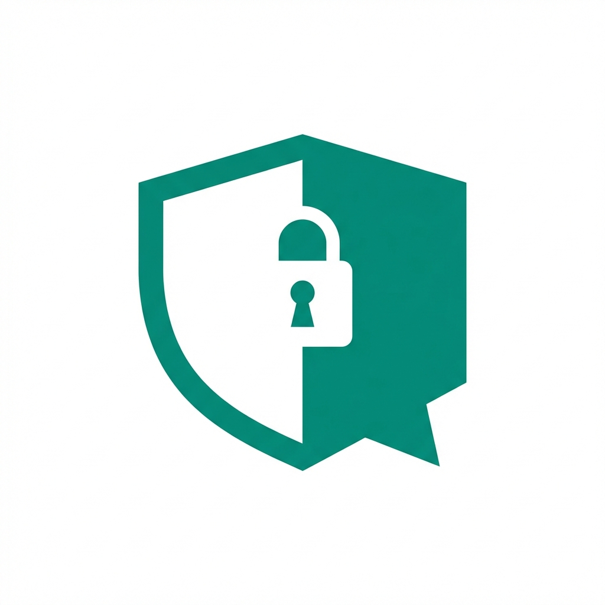

<p align="center">
  
</p>

<h1 align="center">Candour</h1>

<p align="center">
  <em>"Truth needs no name."</em>
</p>

<p align="center">
  <strong>Anonymity-first open source survey tool</strong> built with .NET 9.
</p>

<p align="center">
  <a href="LICENSE"></a>
  
  
</p>

## Why Candour?

Existing survey tools promise anonymity through policy — Candour enforces it through **architecture**. The data model makes re-identification impossible, not just forbidden.

### Anonymity Guarantees

- **Zero PII in responses** — Response records contain no identity fields whatsoever
- **Blind tokens** — HMAC-SHA256 tokens prevent duplicates without linking responses to respondents
- **IP stripping** — Middleware removes all IP-related headers before any handler processes the request
- **Timestamp jitter** — Configurable random offset applied before storage
- **Threshold gating** — Results only available after minimum response count
- **Aggregate-only results** — No API endpoint returns individual response data

## Tech Stack

- **.NET 9** with ASP.NET Core
- **FastEndpoints** for clean API design
- **Blazor** (Server for respondents, WASM for admin)
- **PostgreSQL** with EF Core
- **MediatR** for CQRS
- **Podman/Docker** for containerized deployment

## Quick Start

```bash
podman compose up
```

Then visit:
- Survey form: `http://localhost:5000`
- Admin dashboard: `http://localhost:5000/admin`
- API docs: `http://localhost:5001/scalar`

## License

MIT — see [LICENSE](LICENSE) for details.

## Documentation

- [Anonymity Architecture](docs/ANONYMITY.md) — threat model and design decisions
- [API Reference](docs/API.md) — endpoint documentation
