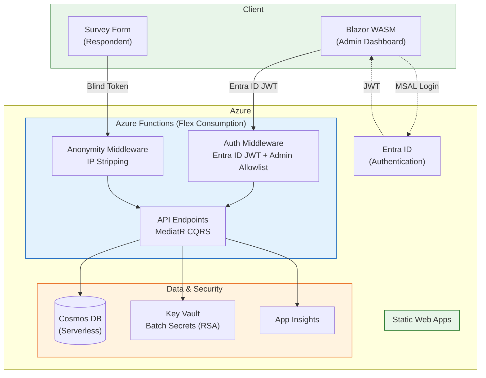

<p align="center">
  
</p>

<h1 align="center">Candour</h1>

<p align="center">
  <em>"Truth needs no name."</em>
</p>

<p align="center">
  <strong>Anonymity-first open source survey tool</strong> built with .NET 9.
</p>

<p align="center">
  <a href="LICENSE"></a>
  
  
</p>

## Why Candour?

Existing survey tools promise anonymity through policy — Candour enforces it through **architecture**. The data model makes re-identification impossible, not just forbidden.

### Anonymity Guarantees

- **Zero PII in responses** — Response records contain no identity fields whatsoever
- **Blind tokens** — HMAC-SHA256 tokens prevent duplicates without linking responses to respondents
- **IP stripping** — Middleware removes all IP-related headers before any handler processes the request
- **Timestamp jitter** — Configurable random offset applied before storage
- **Threshold gating** — Results only available after minimum response count
- **Aggregate-only results** — No API endpoint returns individual response data
- **Admin-only results access** — Aggregate results endpoints require authenticated admin authorization (Entra ID JWT)

## Architecture



**Admin routes** (`/api/surveys`, `.../publish`, `.../analyze`, `.../results`) require Entra ID JWT or API key.
**Public routes** (`/api/surveys/{id}`, `.../validate-token`) are unauthenticated. Response submission (`POST .../responses`) uses blind tokens for anonymous access.

## Tech Stack

- **.NET 9** — Azure Functions (isolated worker) backend, Blazor WebAssembly frontend
- **Azure Cosmos DB** — document storage
- **Entra ID** — JWT bearer authentication for admin operations (API key fallback for dev)
- **MSAL** — Blazor WASM authentication with `AuthorizationMessageHandler`
- **MediatR** — CQRS command/query separation
- **MudBlazor** — Material Design component library

## Quick Start (Local Dev)

### Prerequisites

- [.NET 9 SDK](https://dotnet.microsoft.com/download/dotnet/9.0)
- [Azure Cosmos DB Emulator](https://learn.microsoft.com/en-us/azure/cosmos-db/local-emulator) or a Cosmos DB account
- [Azure Functions Core Tools v4](https://learn.microsoft.com/en-us/azure/azure-functions/functions-run-local)

### Run

```bash
# Terminal 1: Start the Functions API
cd src/Candour.Functions
func start

# Terminal 2: Start the Blazor WASM frontend
cd src/Candour.Web
dotnet run
```

Then visit:
- Frontend: `http://localhost:5000`
- Admin dashboard: `http://localhost:5000/admin`
- API: `http://localhost:7071/api/surveys`

Local dev defaults to API key auth (`Candour__Auth__UseEntraId=false`). With an empty API key, admin routes are open for development.

### Run Tests

```bash
dotnet test
```

## Deployment

See [docs/DEPLOY.md](docs/DEPLOY.md) for full Azure deployment instructions covering:
- Entra ID app registration
- Azure infrastructure provisioning
- Configuration and CORS
- CI/CD pipeline

## Documentation

- [Deployment Guide](docs/DEPLOY.md) — Azure deployment instructions
- [Anonymity Architecture](docs/ANONYMITY.md) — threat model and design decisions
- [User Journeys](docs/USER-JOURNEYS.md) — end-to-end test evidence

## License

MIT — see [LICENSE](LICENSE) for details.
