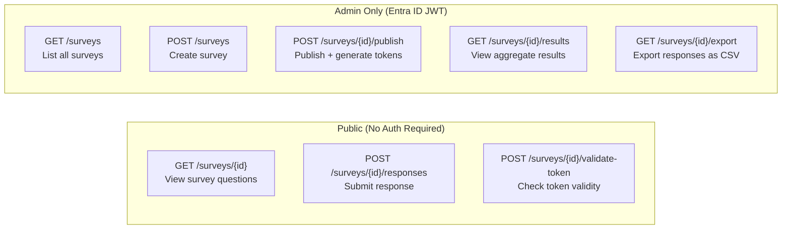

# API Reference

The Candour API is a set of Azure Functions HTTP endpoints that manage anonymous surveys, collect responses via blind tokens, and return aggregate results.

**Base URL:** `https://api.candour.example/api`

---

## Authentication

Candour uses three authentication modes depending on the endpoint:

| Mode | Description | Endpoints |
|------|-------------|-----------|
| **Entra ID JWT** | Admin operations require a Bearer token from Microsoft Entra ID. The token must belong to an allowlisted admin email. | Create, List, Publish, Results, Export |
| **Blind token** | Response submission requires a single-use cryptographic token distributed by the survey creator. | Submit Response |
| **Public** | No authentication required. | Get Survey, Validate Token |

!!! info "Admin JWT format"
    Admin requests must include an `Authorization: Bearer <token>` header. The JWT is validated against Microsoft Entra ID, and the caller's email must appear in the server's admin allowlist. Requests with missing, expired, or non-allowlisted tokens receive `401 Unauthorized` or `403 Forbidden`.

!!! info "Development mode"
    When Entra ID is disabled (`Candour:Auth:UseEntraId = false`), admin routes fall back to API key authentication via the `x-api-key` header.

---

## Endpoint Summary

| Method | Path | Auth | Description |
|--------|------|------|-------------|
| `POST` | [`/api/surveys`](surveys/create.md) | Admin | Create a new survey |
| `GET` | [`/api/surveys`](surveys/list.md) | Admin | List all surveys |
| `GET` | [`/api/surveys/{id}`](surveys/get.md) | Public | Get a survey by ID |
| `POST` | [`/api/surveys/{id}/publish`](surveys/publish.md) | Admin | Publish survey and generate tokens |
| `POST` | `/api/surveys/{id}/analyze` | Admin | Trigger AI analysis of survey responses |
| `POST` | [`/api/surveys/{id}/validate-token`](responses/validate-token.md) | Public | Validate a blind token |
| `POST` | [`/api/surveys/{id}/responses`](responses/submit.md) | Blind token | Submit an anonymous response |
| `GET` | [`/api/surveys/{id}/results`](results/aggregate.md) | Admin | Get aggregate results |
| `GET` | [`/api/surveys/{id}/export`](results/export.md) | Admin | Export responses as CSV |

!!! note "AI analysis requires configuration"
    The `POST /api/surveys/{id}/analyze` endpoint requires AI configuration to be enabled. See [Configuration > Functions API](../configuration/functions.md) for the `Candour__AI__Provider` setting.

---

## Access Control



---

## Error Response Format

All error responses return a JSON body with an `error` field:

```json
{
  "error": "Description of what went wrong."
}
```

| Status | Meaning |
|--------|---------|
| `400 Bad Request` | Invalid or missing request body, malformed GUID |
| `401 Unauthorized` | Missing or invalid authentication token |
| `403 Forbidden` | Authenticated user is not an allowlisted admin, or anonymity threshold not met |
| `404 Not Found` | Requested survey does not exist |
| `429 Too Many Requests` | Rate limit exceeded for this endpoint |

---

## Rate Limiting

Three public-facing endpoints are protected by distributed rate limiting backed by Cosmos DB. Limits are enforced per client IP address.

| Endpoint | Policy | Max Requests | Window |
|----------|--------|--------------|--------|
| `GET /api/surveys/{id}` | `get-survey` | 30 | 60 seconds |
| `POST /api/surveys/{id}/validate-token` | `validate-token` | 10 | 60 seconds |
| `POST /api/surveys/{id}/responses` | `submit-response` | 5 | 60 seconds |

When a rate limit is exceeded, the API returns `429 Too Many Requests` with the following headers:

| Header | Description |
|--------|-------------|
| `Retry-After` | Seconds until the current window expires |
| `X-RateLimit-Limit` | Maximum requests allowed in the window |
| `X-RateLimit-Remaining` | Requests remaining (always `0` on a 429) |

!!! warning "Rate limit fail-open"
    If the Cosmos DB rate-limit store is unavailable, requests are allowed through rather than blocked. This prevents rate-limiting infrastructure failures from causing a total outage.

---

## Anonymity

Candour enforces structural anonymity across every layer of the stack. Response records contain zero personally identifiable information. See the [Architecture Guide](../architecture/overview.md) for full details on the six-layer anonymity model.

Key guarantees relevant to API consumers:

- **IP stripping** -- Client IP addresses and related headers are removed by middleware before any handler processes the request.
- **No PII in responses** -- The `SurveyResponse` entity has no fields for identity data. Adding PII requires a schema change.
- **Timestamp jitter** -- A configurable random offset is applied to submission timestamps before storage.
- **Anonymity threshold** -- Aggregate results and CSV exports are blocked until a minimum number of responses have been collected.
