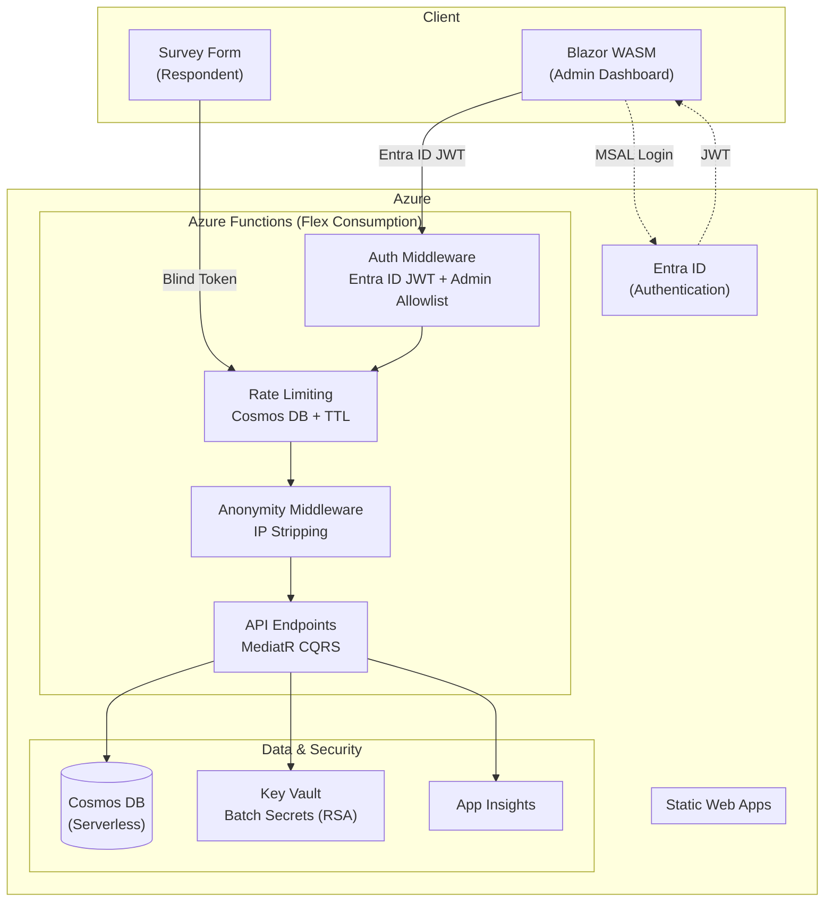

# Architecture Overview

Candour is an anonymity-first survey platform built on Azure serverless infrastructure. The system is designed around a single architectural principle: **response data contains zero identity fields**. Anonymity is not a policy promise -- it is enforced by the shape of the data model itself.

## Personas

Candour serves two distinct personas with different trust boundaries:

**Admin** -- An authenticated user (via Entra ID) who creates surveys, publishes them, and reviews aggregate results. Admins interact through the Blazor WASM dashboard and must present a valid JWT on every API call to protected endpoints.

**Respondent** -- An anonymous participant who receives a one-time token link, fills out a survey, and submits a response. Respondents never authenticate. The system strips all identifying information from their requests before any handler processes them.

## System Architecture



## Component Descriptions

### Azure Static Web Apps (SWA)

Hosts the Blazor WebAssembly frontend as static files. The SWA serves both the admin dashboard and the respondent survey form. Since Blazor WASM runs entirely in the browser, the SWA is a pure file host with no server-side rendering.

- **Admin Dashboard** -- Survey creation, publishing, and aggregate results review. Requires MSAL authentication.
- **Survey Form** -- Respondent-facing form loaded via a token link. No authentication required.

### Azure Functions (Flex Consumption)

The API backend runs as .NET 9 isolated worker Azure Functions on the Flex Consumption plan. Requests pass through three middleware layers (authentication, rate limiting, anonymity) before reaching the MediatR CQRS handlers.

The Flex Consumption plan provides serverless scaling with no always-on compute cost -- the API scales to zero when idle and scales out automatically under load.

### Cosmos DB (Serverless)

The document database stores all application data across four containers: surveys, responses, used tokens, and rate limit entries. Cosmos DB serverless billing means you pay per request unit consumed, with no provisioned throughput cost.

Cosmos DB was chosen for three reasons:

1. **Document model** -- Survey questions and response answers are naturally hierarchical JSON.
2. **TTL support** -- Rate limit entries auto-expire without a cleanup job.
3. **Partition isolation** -- Responses partition by `surveyId`, keeping per-survey aggregation queries efficient.

### Azure Key Vault

Stores RSA keys used to protect batch secrets. When a survey is published, its batch secret (used for HMAC-SHA256 token generation) is encrypted with Key Vault RSA wrap before storage. In local development, ASP.NET Data Protection provides a fallback.

### Entra ID

Provides OAuth 2.0 / OpenID Connect authentication for admin users. The Blazor WASM frontend uses MSAL to obtain JWTs, which the Functions API validates against the tenant's OpenID configuration. An admin email allowlist further restricts access to authorized users.

### Application Insights

Collects telemetry, request traces, and error logs from the Functions API. Integrated via the Application Insights worker service SDK.

!!! warning "Anonymity and telemetry"
    Application Insights is configured on the **API layer only**. The anonymity middleware strips identifying headers before handlers execute, so request telemetry does not contain client IP addresses for respondent routes.

## Request Flows

### Admin Operations

Admin operations include creating surveys, publishing them, viewing aggregate results, and exporting response data.

```
Browser (Blazor WASM)
  |
  |-- MSAL login --> Entra ID --> JWT returned
  |
  |-- GET/POST /api/surveys (with Bearer JWT)
        |
        +--> AuthenticationMiddleware: validate JWT, check admin allowlist
        +--> RateLimitingMiddleware: skip (admin routes not rate-limited)
        +--> AnonymityMiddleware: skip (admin routes not matched)
        +--> MediatR Handler: execute command/query
        +--> Cosmos DB: read/write survey data
```

Admin routes require authentication while public routes are accessible without credentials. See the [API Reference](../api/overview.md#endpoint-summary) for the complete endpoint list.

### Respondent Operations

Respondent operations include loading a survey, validating a token, and submitting a response. These routes are unauthenticated and pass through rate limiting and anonymity stripping.

```
Browser (Survey Form)
  |
  |-- GET /api/surveys/{id} (public, no auth)
        |
        +--> AuthenticationMiddleware: skip (not an admin route)
        +--> RateLimitingMiddleware: enforce get-survey policy (IP-based)
        +--> AnonymityMiddleware: strip identifying headers
        +--> MediatR Handler: return survey definition
  |
  |-- POST /api/surveys/{id}/validate-token
        |
        +--> AuthenticationMiddleware: skip
        +--> RateLimitingMiddleware: enforce validate-token policy (IP-based)
        +--> AnonymityMiddleware: strip identifying headers
        +--> MediatR Handler: verify token, check for duplicates
  |
  |-- POST /api/surveys/{id}/responses (with blind token)
        |
        +--> AuthenticationMiddleware: skip
        +--> RateLimitingMiddleware: enforce submit-response policy (IP-based)
        +--> AnonymityMiddleware: strip identifying headers, remove Set-Cookie from response
        +--> MediatR Handler: jitter timestamp, store response (zero PII)
```

!!! info "Middleware ordering matters"
    Rate limiting runs **before** anonymity stripping because it needs the `X-Forwarded-For` header to derive the client IP key. Once rate limiting completes, the anonymity middleware removes all IP-related headers so that no downstream handler or telemetry system can access them. See [Middleware Pipeline](middleware-pipeline.md) for details.
