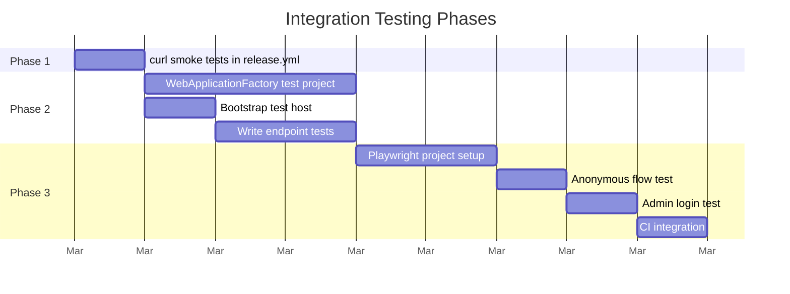

# Integration Testing Design

!!! info "Implementation status"
    This design document describes the integration testing strategy shipped in v0.4.0.
    For testing guidance, see [Testing](../development/testing.md).

## Summary

Candour's integration testing strategy adds three tiers of testing to the CI/CD pipeline. Each tier catches a different class of defect, and all three are free to run on GitHub Actions.

| Phase | Approach | Defects caught | Pipeline stage |
|-------|----------|----------------|----------------|
| **1. curl smoke tests** | HTTP calls against the live deployment | Infrastructure misconfiguration, deployment failures, CORS issues | Post-deploy |
| **2. WebApplicationFactory tests** | In-process API testing with mocked Cosmos DB | Handler regressions, middleware bugs, auth logic errors | Pre-deploy |
| **3. Playwright browser tests** | Full browser automation against the live Static Web App | UI regressions, Blazor rendering issues, authentication flows | Post-deploy |

---

## Current Test Coverage

Candour has six unit test projects covering handlers, entities, middleware regex, crypto, document mapping, and anonymity contracts. All run via `dotnet test` in CI.

**The gap:** No unit test verifies that a deployed instance actually works. A successful `dotnet build` does not catch:

- Missing app settings in production
- Cosmos DB container misconfiguration
- CORS policy blocking the frontend
- Entra ID token validation against real OIDC metadata
- Blazor WASM loading and rendering failures

---

## Phase 1: curl Smoke Tests

Post-deploy HTTP checks that confirm deployed endpoints respond with expected status codes.

### Endpoints Tested

| # | Method | Endpoint | Expected status | Authentication |
|---|--------|----------|----------------|----------------|
| 1 | `GET` | `/api/surveys/{id}` | 404 (survey does not exist, but endpoint is reachable) | None |
| 2 | `POST` | `/api/surveys/{id}/validate-token` | 200 with `{"valid":false}` | None |
| 3 | `GET` | `/api/surveys` | 401 Unauthorized | None (verifies auth gate) |
| 4 | `POST` | `/api/surveys` | 401 Unauthorized | None (verifies auth gate) |
| 5 | `GET` | `/api/surveys/{id}/results` | 401 Unauthorized | None (verifies auth gate) |

Tests 1--2 confirm public endpoints are reachable. Tests 3--5 confirm admin endpoints reject unauthenticated requests.

### Configuration

- `API_BASE_URL` is stored as a GitHub Actions **repository variable** (not a secret -- it is a public URL)
- No secrets are required -- tests only hit public endpoints or verify `401` responses on admin endpoints
- A 15-second delay before tests accounts for Azure Functions cold start after deployment

### Limitations

- Does not test authenticated admin flows (would require storing Entra ID credentials)
- Does not validate response bodies beyond status codes
- Does not test the frontend

---

## Phase 2: WebApplicationFactory Integration Tests

In-process API testing with mocked Cosmos DB. Catches handler logic regressions, middleware behavior issues, and DI wiring problems before deployment.

### The Challenge

Azure Functions isolated worker does not support `WebApplicationFactory<T>` out of the box. The host is a `FunctionsApplication`, not an ASP.NET Core `WebApplication`.

### Approach

A test host mirrors `Program.cs` but replaces external dependencies with mocks:

```
Production:  CosmosClient -> Cosmos DB (Azure)
Test:        Mock<ISurveyRepository> -> In-memory test data
```

This reuses the existing unit test pattern (Moq repositories) but adds the middleware pipeline, so requests flow through `AuthenticationMiddleware` -> `AnonymityMiddleware` -> handler.

### Test Project Structure

```
tests/Candour.Functions.Integration.Tests/
    Candour.Functions.Integration.Tests.csproj
    TestFunctionHost.cs          -- bootstraps isolated worker host with mocks
    SurveyEndpointTests.cs       -- GET/POST /surveys
    ResponseEndpointTests.cs     -- POST /responses, validate-token
    AuthMiddlewareTests.cs       -- 401 enforcement on admin routes
    AnonymityMiddlewareTests.cs  -- header stripping verification
```

### Test Cases

| Test | Endpoint | Setup | Expected result |
|------|----------|-------|-----------------|
| Get survey returns questions | `GET /surveys/{id}` | Mock returns survey with 3 questions | 200 + JSON with `questions[]` |
| Get missing survey returns 404 | `GET /surveys/{id}` | Mock returns null | 404 |
| Submit response with valid token | `POST /surveys/{id}/responses` | Mock active survey, valid token | 200 |
| Submit response with used token | `POST /surveys/{id}/responses` | Mock `ExistsAsync` returns true | 409 |
| Admin list requires auth | `GET /surveys` | No auth header | 401 |
| Admin list with API key | `GET /surveys` | `X-Api-Key` header | 200 |
| Anonymity strips IP header | `POST /surveys/{id}/responses` | Set `X-Forwarded-For` | Response processed; header absent from handler context |
| Threshold gate blocks results | `GET /surveys/{id}/results` | Mock 1 response, threshold 5 | 200 + error message |

### CI Integration

No CI workflow change is required. The integration test project is discovered automatically by `dotnet test` at the solution level.

### Limitations

- Tests run against mocked repositories, not real Cosmos DB
- Cannot catch Cosmos-specific bugs such as serialization errors or partition key mismatches
- Host bootstrap may require adaptation as the Azure Functions SDK evolves

---

## Phase 3: Playwright Browser Tests

Full end-to-end browser tests against the live Static Web App and API. Tests the Blazor WASM frontend, Entra ID authentication, and the complete respondent flow.

### Prerequisites

- A test Entra ID user in the tenant (for example, `test-admin@yourdomain.onmicrosoft.com`)
- Password authentication enabled for that user (not MFA-only)
- A seeded test survey in the deployed environment
- Credentials stored in GitHub Actions secrets

### Test Project Structure

The E2E tests use `@playwright/test` (TypeScript) since they run against a deployed URL, not an in-process host.

```
tests/e2e/
    package.json
    playwright.config.ts
    tests/
        anonymous-survey.spec.ts    -- respondent flow
        admin-dashboard.spec.ts     -- admin login + dashboard
        auth-enforcement.spec.ts    -- verify redirect to login
        404-page.spec.ts            -- not found page
    .env.example
```

### Test Scenarios

**Anonymous Survey Submission:**

1. Navigate to `/survey/{testSurveyId}?t={testToken}`
2. Assert survey title is visible
3. Select a radio button for a multiple choice question
4. Fill in a free text question
5. Click "Submit Anonymously"
6. Assert success message: "Your anonymous response has been recorded"

!!! note "Token consumption"
    Each test run consumes a token. Either generate fresh tokens or re-publish the survey in a setup step.

**Admin Login and Dashboard:**

1. Navigate to `/admin`
2. Assert redirect to Entra ID login
3. Fill email and click Next
4. Fill password and click Sign in
5. Assert redirect back to `/admin`
6. Assert survey table is visible with at least one row

**Auth Enforcement:**

1. Navigate to `/admin` without logging in
2. Assert redirect to `/authentication/login`
3. Navigate to `/admin/builder`
4. Assert redirect to `/authentication/login`

**404 Page:**

1. Navigate to `/nonexistent-page`
2. Assert "Page Not Found" heading is visible
3. Assert "Go Home" button is visible

### Entra ID Login in Headless Browsers

Entra ID's login page works in headless Chromium. The selectors for the Microsoft login form:

```typescript
await page.fill('input[name="loginfmt"]', email);
await page.click('input[type="submit"]');
await page.fill('input[name="passwd"]', password);
await page.click('input[type="submit"]');
// Handle "Stay signed in?" prompt
await page.click('input[value="No"]');
```

!!! warning "Fragile selectors"
    Microsoft periodically changes the login page DOM. Pin the Playwright version and update selectors when tests break.

### Limitations

- Consumes real tokens on each run (requires a token refresh strategy)
- Entra ID login selectors may break with Microsoft UI updates
- Blazor WASM cold load takes 5--15 seconds (set generous timeouts)
- Tests run against live infrastructure and may flake during Azure outages
- Requires maintaining test user credentials

---

## Implementation Order



Phase 1 provides immediate value with roughly 30 minutes of work. Phase 2 catches most regressions before deployment. Phase 3 is optional -- implement only if UI bugs recur in production.

---

## Implementation Status

- **Phase 2:** Implemented and running in CI on every push and pull request. No external environment is required.
- **Phases 1 and 3:** Scaffolded in the deploy workflow but gated behind repository variables (`API_BASE_URL`, `SWA_BASE_URL`). Jobs skip automatically when these variables are not configured. To activate, add the variables in **GitHub > Settings > Secrets and variables > Actions**.

Phase gates are controlled by repository variables. Enable `RUN_INTEGRATION_TESTS` and `RUN_E2E_TESTS` to activate each phase in your fork's CI/CD pipeline.

---

## Required GitHub Configuration

| Name | Type | Phase | Description |
|------|------|-------|-------------|
| `API_BASE_URL` | Variable | 1 | Function App public URL |
| `SWA_BASE_URL` | Variable | 3 | Static Web App public URL |
| `TEST_SURVEY_ID` | Variable | 3 | UUID of a seeded test survey |
| `TEST_ADMIN_EMAIL` | Secret | 3 | Test admin email address |
| `TEST_ADMIN_PASSWORD` | Secret | 3 | Test admin password |
