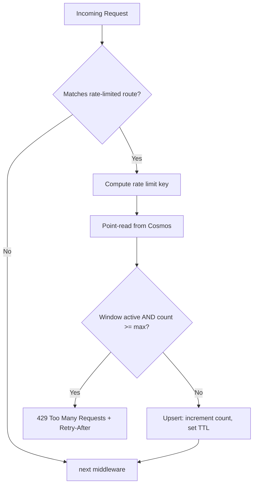

# Rate Limiting Design

!!! info "Implementation status"
    This design document describes the rate limiting system shipped in v0.4.0.
    For configuration, see [Rate Limiting Configuration](../configuration/rate-limiting.md).

## Summary

Distributed rate limiting for Candour's public API endpoints, backed by a Cosmos DB container with TTL-based auto-cleanup. Rate limit state persists across Function App scale-to-zero events and multi-instance scale-out, at a cost of approximately $0.01--$0.05 per month.

---

## Problem Statement

Candour exposes three public endpoints that accept unauthenticated requests:

| Endpoint | Risk |
|----------|------|
| `POST /api/surveys/{id}/responses` | Token brute-force, spam submissions |
| `POST /api/surveys/{id}/validate-token` | Token enumeration |
| `GET /api/surveys/{id}` | Scraping, reconnaissance |

Without rate limiting, an attacker can flood these endpoints. Azure Functions Flex Consumption charges per execution, so a sustained attack both increases cost and degrades service for legitimate users.

---

## Rejected Alternatives

| Option | Reason for rejection |
|--------|---------------------|
| Azure API Management | Minimum cost of $30--$50/month exceeds the sub-$1/month budget target |
| Azure Front Door | Minimum cost of $20--$50/month; same budget concern |
| In-process memory (`System.Threading.RateLimiting`) | Counters reset on scale-to-zero; state is not shared across instances |

!!! note "In-process memory as a quick-win"
    In-process rate limiting is acceptable as a Phase 0 stopgap but does not provide durable protection in a serverless environment where instances are ephemeral.

---

## Design

### Middleware Placement

Rate limiting runs between the authentication and anonymity middleware:

```
AuthenticationMiddleware   <-- validates admin JWT (if applicable)
    |
RateLimitingMiddleware     <-- checks Cosmos, returns 429 if exceeded
    |
AnonymityMiddleware        <-- strips IP headers from respondent routes
    |
Function handlers          <-- MediatR dispatch
```

!!! tip "Why this ordering matters"
    **After authentication:** Admin requests are already identified. Rate limiting can apply different policies to authenticated admin requests versus public requests.

    **Before anonymity:** The middleware can read `X-Forwarded-For` for IP-based limiting on `GET /surveys/{id}` before `AnonymityMiddleware` strips the header.

Registration in `Program.cs`:

```csharp
builder.UseMiddleware<AuthenticationMiddleware>();
builder.UseMiddleware<RateLimitingMiddleware>();  // rate limiting
builder.UseMiddleware<AnonymityMiddleware>();
```

### Rate Limit Keys

All rate-limited endpoints use IP-based keys. The key format is `ip:<client-ip>:<policy-name>`.

| Endpoint | Key format |
|----------|-----------|
| `GET /surveys/{id}` | `ip:{client-ip}:get-survey` |
| `POST /surveys/{id}/validate-token` | `ip:{client-ip}:validate-token` |
| `POST /surveys/{id}/responses` | `ip:{client-ip}:submit-response` |

!!! note "Why IP-only? Body streams are not seekable in the isolated worker model"
    An earlier design used token-hash keys (`token:{sha256(token)}:validate`) for the `POST` endpoints, which would have avoided any IP dependency. This was removed because **Azure Functions isolated worker body streams are not seekable** -- reading the request body in middleware prevents downstream handlers from deserializing it. As a result, the middleware cannot access the token without consuming the body, so all endpoints fall back to IP-based keys.

Admin endpoints (`GET /surveys`, `POST /surveys`, etc.) are gated by Entra ID JWT validation. Rate limiting is not applied to these routes -- an authenticated admin is unlikely to self-attack.

### Cosmos DB Container

A `rateLimits` container sits alongside the existing `surveys`, `responses`, and `usedTokens` containers:

| Property | Value |
|----------|-------|
| Container name | `rateLimits` |
| Partition key | `/key` |
| Default TTL | Enabled (container-level) |
| Unique key policy | None (counters are upserted, not inserted) |

#### Document Schema

```json
{
  "id": "ip:203.0.113.42:get-survey",
  "key": "ip:203.0.113.42:get-survey",
  "count": 7,
  "windowStart": "2026-02-27T14:00:00Z",
  "ttl": 60
}
```

- `id` and `key` are identical. The partition key equals the document key, enabling efficient point reads.
- `count` increments with each request within the current window.
- `windowStart` marks the beginning of the current fixed window.
- `ttl` is set in seconds. Cosmos DB automatically deletes expired documents, eliminating the need for a cleanup job.

#### RU Cost Estimate

| Operation | RUs | Frequency |
|-----------|-----|-----------|
| Point read (check counter) | ~1 RU | Every public request |
| Upsert (increment counter) | ~6 RU | Every public request |
| **Total per request** | **~7 RU** | |

At 1,000 requests per day: ~7,000 RU/day = ~210,000 RU/month = approximately **$0.05/month**.

### Per-Endpoint Policies

Policies are defined in configuration and bound via `IOptions<RateLimitingOptions>`:

```json
{
  "RateLimiting": {
    "Policies": {
      "get-survey": {
        "WindowSeconds": 60,
        "MaxRequests": 30
      },
      "validate-token": {
        "WindowSeconds": 60,
        "MaxRequests": 10
      },
      "submit-response": {
        "WindowSeconds": 60,
        "MaxRequests": 5
      }
    }
  }
}
```

!!! warning "Token validation is the tightest limit"
    The `validate-token` endpoint allows only 10 requests per minute, and `submit-response` allows only 5. These are the most sensitive endpoints for abuse -- token enumeration and spam submissions.

### Middleware Logic

```
1. Extract route -> determine which policy applies (skip if no match)
2. Compute rate limit key (IP-based for all endpoints):
   - GET /surveys/{id}:         key = "ip:{X-Forwarded-For}:get-survey"
   - POST .../validate-token:   key = "ip:{X-Forwarded-For}:validate-token"
   - POST .../responses:        key = "ip:{X-Forwarded-For}:submit-response"
3. Point-read document from Cosmos by id = key, partition = key
4. If document exists AND window is active AND count >= maxRequests:
   -> Return 429 Too Many Requests with Retry-After header
5. If document exists AND window has expired:
   -> Upsert with count = 1, new windowStart, TTL = windowSeconds
6. If document exists AND window is active AND count < max:
   -> Upsert with count + 1
7. If document does not exist:
   -> Upsert with count = 1, windowStart = now, TTL = windowSeconds
8. Call next(context)
```

Steps 4--7 collapse into a single upsert with conditional logic. The TTL ensures stale windows are garbage-collected without a background cleanup process.

### Flow Diagram



### Interface

```csharp
public interface IRateLimitRepository
{
    Task<RateLimitEntry?> GetAsync(string key, CancellationToken ct = default);
    Task UpsertAsync(RateLimitEntry entry, CancellationToken ct = default);
}
```

This follows the existing repository pattern in the codebase. The implementation is registered as a singleton, consistent with other Cosmos repositories.

### 429 Response Format

When a rate limit is exceeded, the middleware returns:

```json
{
  "error": "Rate limit exceeded. Try again in 42 seconds."
}
```

With the following headers:

| Header | Value | Description |
|--------|-------|-------------|
| `Retry-After` | `42` | Seconds until the current window resets |
| `X-RateLimit-Limit` | `10` | Maximum requests allowed per window |
| `X-RateLimit-Remaining` | `0` | Remaining requests in the current window |

---

## Anonymity Considerations

Rate limiting interacts with Candour's anonymity guarantees. Each key strategy is designed to minimize data exposure:

- **IP-based keys (all endpoints):** The IP address is read from `X-Forwarded-For` before `AnonymityMiddleware` strips the header. The IP is stored in Cosmos as part of the rate limit key but is auto-deleted by TTL within 60 seconds. This is a deliberate tradeoff: short-lived IP storage enables abuse prevention without persistent tracking.

- **No logging of rate limit keys:** The middleware logs throttle events to Application Insights with the endpoint name and count, but never logs the key value itself.

---

## Observability

Throttled requests are logged as custom Application Insights events:

```
RateLimitThrottled { endpoint: "validate-token", windowSeconds: 60 }
```

Set up an Azure Monitor alert if the throttle count exceeds a configurable threshold. A sustained spike indicates either an active attack or a misconfigured client.

---

## Implementation Files

| File | Change |
|------|--------|
| `src/Candour.Core/Interfaces/IRateLimitRepository.cs` | Repository interface |
| `src/Candour.Core/Entities/RateLimitEntry.cs` | Rate limit entry entity |
| `src/Candour.Infrastructure.Cosmos/Data/CosmosRateLimitRepository.cs` | Cosmos DB repository implementation |
| `src/Candour.Infrastructure.Cosmos/CosmosDbOptions.cs` | `RateLimitsContainer` property |
| `src/Candour.Infrastructure.Cosmos/CosmosDbInitializer.cs` | Container auto-creation |
| `src/Candour.Infrastructure.Cosmos/DependencyInjection.cs` | Repository DI registration |
| `src/Candour.Functions/Middleware/RateLimitingMiddleware.cs` | Middleware implementation |
| `src/Candour.Functions/Program.cs` | Middleware registration |
| `infra/resources.bicep` | `rateLimits` container definition |
| `tests/Candour.Functions.Tests/RateLimitingMiddlewareTests.cs` | Unit tests |

---

## Testing

| Test case | Description |
|-----------|-------------|
| Middleware returns 429 when count >= max | Mock repository returns a counter at the limit; verify 429 response with `Retry-After` header |
| Middleware passes through when count < max | Mock repository returns a counter below the limit; verify request proceeds |
| Middleware skips non-matching routes | Request to an unrelated route; verify no Cosmos interaction |
| Correct key extraction per endpoint | Verify IP-based key for all rate-limited endpoints |
| Cosmos upsert increments correctly | Integration test verifying counter increment and TTL behavior |
