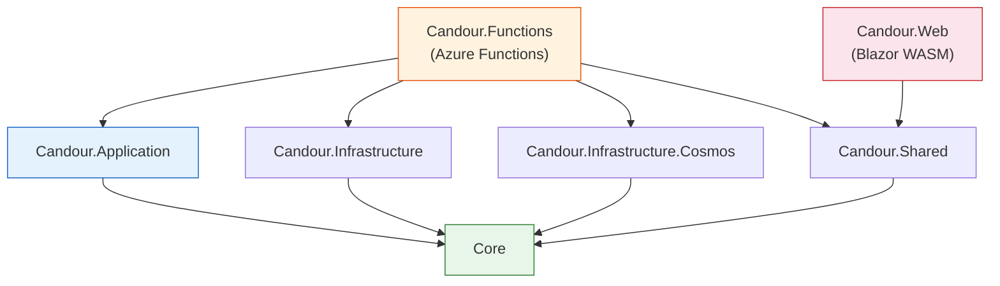

# Project Structure

Candour follows a clean architecture pattern with clearly separated layers. This page describes the solution layout, what each project is responsible for, and how they relate to each other.

## Solution Overview

```
candour/
├── src/
│   ├── Candour.Core/                    # Domain entities and interfaces
│   ├── Candour.Application/             # Business logic (MediatR handlers)
│   ├── Candour.Infrastructure/          # Infrastructure abstractions and implementations
│   ├── Candour.Infrastructure.Cosmos/   # Cosmos DB-specific implementations
│   ├── Candour.Functions/               # Azure Functions API (HTTP entry point)
│   ├── Candour.Shared/                  # Shared DTOs and contracts
│   └── Candour.Web/                     # Blazor WebAssembly frontend
├── tests/
│   ├── Candour.Core.Tests/              # Entity and value object tests
│   ├── Candour.Application.Tests/       # Handler unit tests
│   ├── Candour.Infrastructure.Tests/    # Infrastructure implementation tests
│   ├── Candour.Infrastructure.Cosmos.Tests/  # Document mapping tests
│   ├── Candour.Functions.Tests/         # Middleware and auth tests
│   ├── Candour.Functions.Integration.Tests/  # Integration tests (in-process API)
│   ├── Candour.Anonymity.Tests/         # Anonymity contract tests
│   └── e2e/                             # Playwright browser tests (TypeScript)
├── docs/                                # Design documents and evidence
├── docs-site/                           # MkDocs Material documentation site
└── Candour.sln                          # Solution file
```

## Source Projects

### Candour.Core

The domain layer. Contains entities, interfaces, enums, and value objects. Has **zero** external dependencies -- this project defines the contracts that all other projects implement or consume.

```
Candour.Core/
├── Entities/
│   ├── Survey.cs              # Survey aggregate root
│   ├── Question.cs            # Question entity (part of Survey)
│   ├── SurveyResponse.cs      # Anonymous response record
│   ├── UsedToken.cs           # Consumed token hash
│   └── RateLimitEntry.cs      # Rate limiting record
├── Interfaces/
│   ├── ISurveyRepository.cs   # Survey persistence contract
│   ├── IResponseRepository.cs # Response persistence contract
│   ├── IUsedTokenRepository.cs # Token tracking contract
│   ├── IRateLimitRepository.cs # Rate limit persistence contract
│   ├── ITokenService.cs       # Token generation/validation contract
│   ├── IBatchSecretProtector.cs # Key Vault integration contract
│   ├── ITimestampJitterService.cs # Jitter application contract
│   ├── IAiAnalyzer.cs         # AI analysis contract
│   └── IRepository.cs         # Base repository interface
├── Enums/                     # Survey status, question type enums
└── ValueObjects/              # Strongly-typed identifiers
```

### Candour.Application

The application layer. Contains MediatR command and query handlers that implement business logic. Depends only on `Candour.Core` interfaces -- never on infrastructure details.

```
Candour.Application/
├── Surveys/
│   ├── CreateSurvey.cs        # Command + handler for survey creation
│   ├── GetSurvey.cs           # Query + handler for survey retrieval
│   ├── ListSurveys.cs         # Query + handler for listing all surveys
│   ├── PublishSurvey.cs       # Command + handler for publishing + token generation
│   └── CloseSurvey.cs         # Command + handler for closing a survey
├── Responses/
│   └── ...                    # Submit response, validate token handlers
├── Analysis/
│   └── ...                    # AI analysis and aggregate results handlers
└── DependencyInjection.cs     # AddApplication() extension method for MediatR registration
```

Each file in the `Surveys/` and `Responses/` directories follows the CQRS pattern: the command/query record and its handler are defined in the same file.

### Candour.Infrastructure

Infrastructure implementations that are **not** Cosmos DB-specific. Contains cryptographic services, the AI analyzer, and shared data utilities.

```
Candour.Infrastructure/
├── Crypto/
│   └── ...                    # Blind token service (HMAC-SHA256)
├── AI/
│   └── ...                    # AI analyzer implementations
├── Data/
│   └── ...                    # Shared data access utilities
└── DependencyInjection.cs     # AddInfrastructure() extension method
```

### Candour.Infrastructure.Cosmos

Cosmos DB-specific repository implementations. This is the only project that references the Azure Cosmos DB SDK. Isolating it enables future database portability.

```
Candour.Infrastructure.Cosmos/
├── Data/
│   └── ...                    # ISurveyRepository, IResponseRepository, etc. implementations
├── Documents/
│   └── ...                    # Cosmos DB document models (separate from domain entities)
├── Crypto/
│   └── ...                    # Key Vault-backed batch secret protector
├── CosmosDbInitializer.cs     # Creates database and containers on startup
├── CosmosDbOptions.cs         # Configuration binding
└── DependencyInjection.cs     # AddCosmos() extension method
```

!!! note "Document vs. Entity Separation"
    Domain entities in `Candour.Core` are mapped to/from Cosmos DB documents in `Candour.Infrastructure.Cosmos`. This separation ensures the domain model is not polluted with Cosmos-specific attributes (`[JsonProperty]`, partition key fields, etc.).

### Candour.Functions

The Azure Functions isolated worker project. This is the HTTP entry point for the API. Contains function definitions, middleware, and authentication logic.

```
Candour.Functions/
├── Functions/
│   ├── CreateSurveyFunction.cs
│   ├── GetSurveyFunction.cs
│   ├── ListSurveysFunction.cs
│   ├── PublishSurveyFunction.cs
│   ├── SubmitResponseFunction.cs
│   ├── ValidateTokenFunction.cs
│   ├── GetResultsFunction.cs
│   ├── ExportCsvFunction.cs
│   └── RunAnalysisFunction.cs
├── Middleware/
│   └── ...                    # Auth, anonymity, rate limiting middleware
├── Auth/
│   └── ...                    # JWT validation, API key auth, admin allowlist
├── Program.cs                 # Host builder and DI configuration
├── host.json                  # Functions host configuration
└── local.settings.json        # Local development settings
```

Each function is a thin HTTP adapter that delegates to a MediatR handler. Functions handle HTTP concerns (request parsing, status codes, headers) while the `Candour.Application` layer handles business logic.

### Candour.Shared

Shared DTOs, contracts, and models used by both the API (`Candour.Functions`) and the frontend (`Candour.Web`). This project enables type-safe communication between the frontend and backend.

```
Candour.Shared/
├── Contracts/
│   └── ...                    # Request/response DTOs (CreateSurveyRequest, SurveyDto, etc.)
├── Models/
│   └── ...                    # Shared domain models
└── Services/
    └── ...                    # Shared service interfaces (ICandourApiClient)
```

### Candour.Web

The Blazor WebAssembly frontend. A client-side SPA hosted on Azure Static Web Apps.

```
Candour.Web/
├── Pages/
│   ├── Home.razor             # Landing page
│   ├── Admin/
│   │   ├── Dashboard.razor    # Survey list dashboard
│   │   ├── Builder.razor      # Survey creation form
│   │   └── SurveyDetail.razor # Survey detail, publish, results
│   └── Survey/
│       └── ...                # Respondent-facing survey form
├── Layout/
│   └── ...                    # Main layout, nav menu
├── wwwroot/
│   └── ...                    # Static assets, CSS
└── Program.cs                 # WASM host, MSAL auth, HttpClient setup
```

## Dependency Relationships



**Dependency rule:** Dependencies point inward. `Candour.Core` depends on nothing. `Candour.Application` depends only on `Candour.Core`. Infrastructure and presentation layers depend on the inner layers but never on each other.

## Key Conventions

### File Naming

- **Entities:** PascalCase noun (`Survey.cs`, `Question.cs`)
- **Handlers:** Verb + Noun (`CreateSurvey.cs`, `GetSurvey.cs`)
- **Functions:** Verb + Noun + `Function` suffix (`CreateSurveyFunction.cs`)
- **Tests:** Subject + `Tests` suffix (`CreateSurveyHandlerTests.cs`)
- **Documents:** Entity + `Document` suffix (`SurveyDocument.cs`)

### Project Naming

All projects use the `Candour.` prefix. Test projects append `.Tests` to their corresponding source project name:

| Source Project | Test Project |
|---------------|-------------|
| `Candour.Core` | `Candour.Core.Tests` |
| `Candour.Application` | `Candour.Application.Tests` |
| `Candour.Infrastructure` | `Candour.Infrastructure.Tests` |
| `Candour.Infrastructure.Cosmos` | `Candour.Infrastructure.Cosmos.Tests` |
| `Candour.Functions` | `Candour.Functions.Tests` |

Special test projects that span multiple layers:

| Test Project | Purpose |
|-------------|---------|
| `Candour.Anonymity.Tests` | Cross-cutting anonymity contract tests (IP stripping, token blindness, threshold gating, timestamp jitter, response unlinkability) |
| `Candour.Functions.Integration.Tests` | In-process API integration tests with mocked Cosmos DB |
| `e2e/` | Playwright browser tests (TypeScript, runs against deployed instance) |
