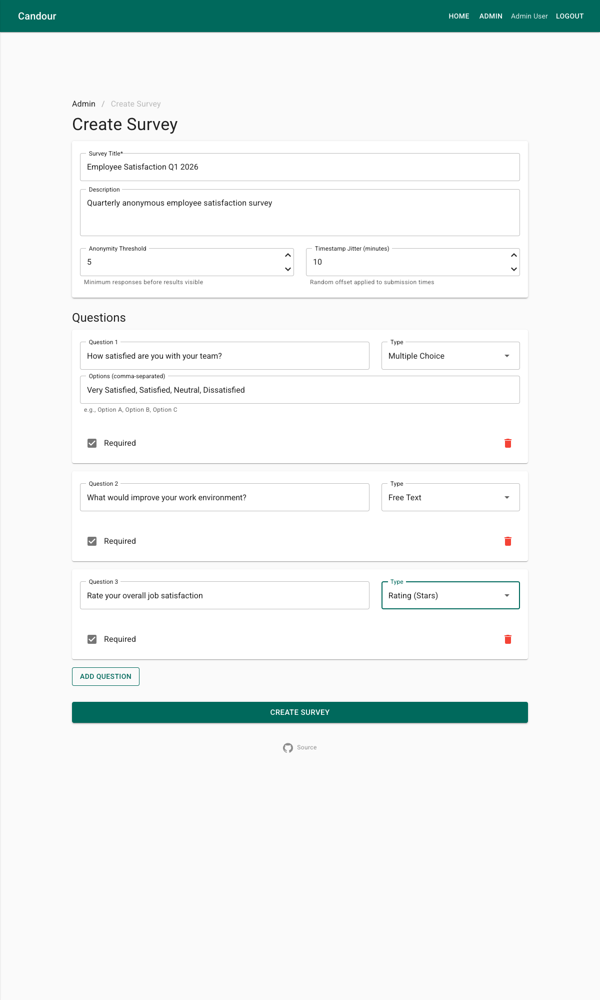
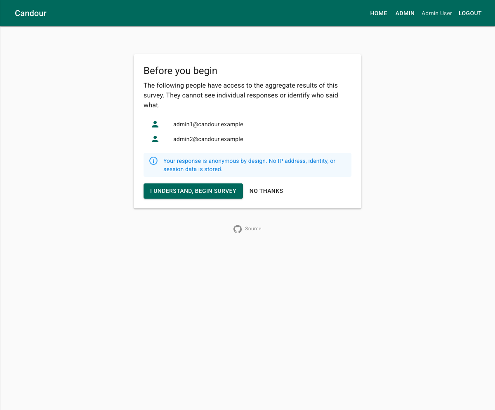
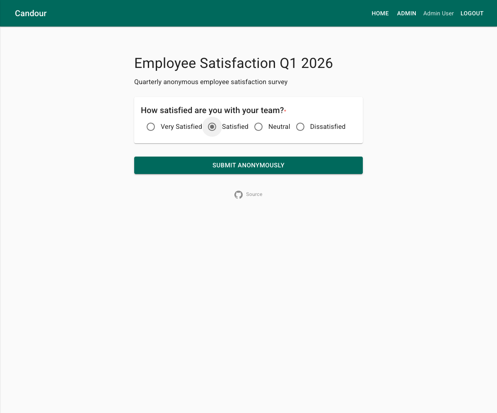
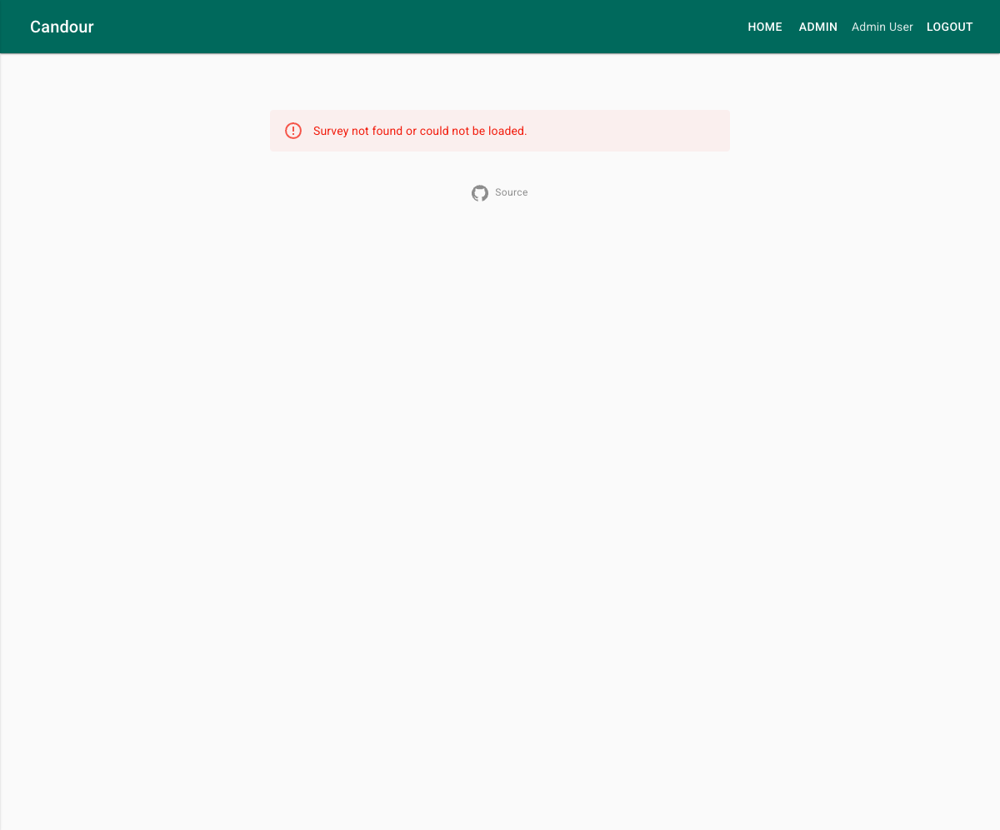
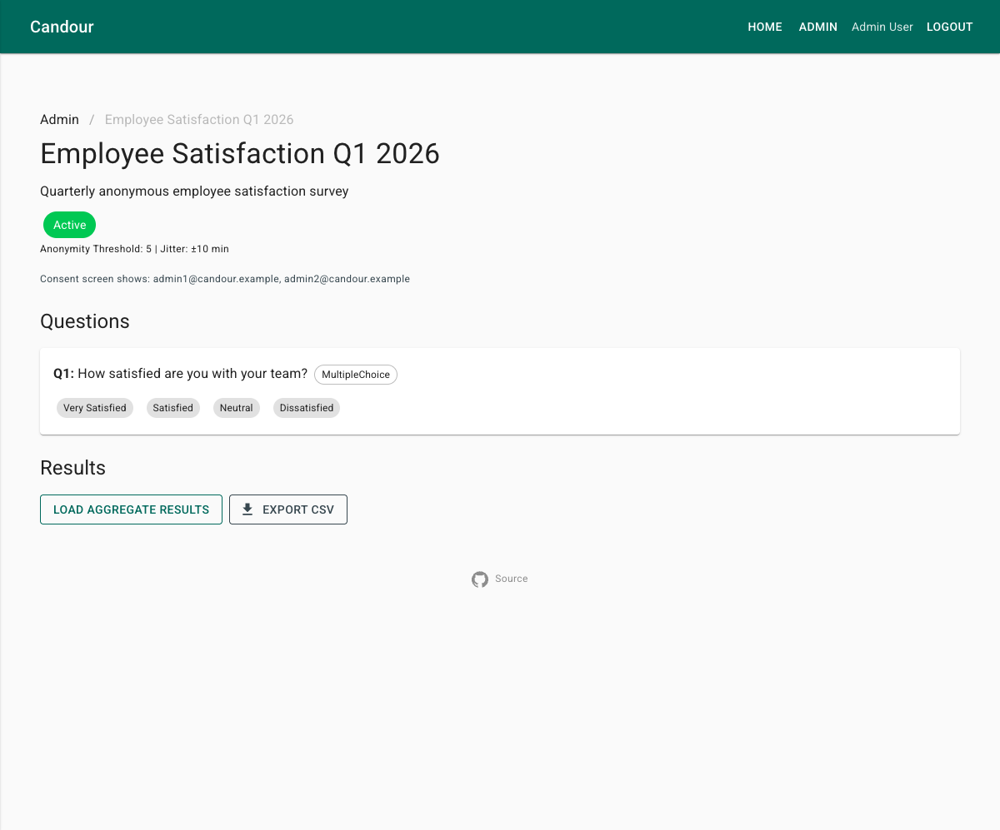
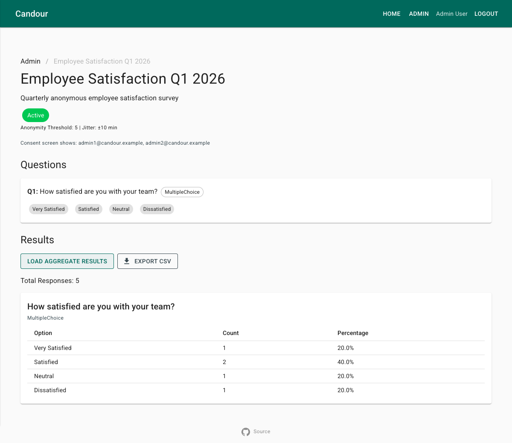
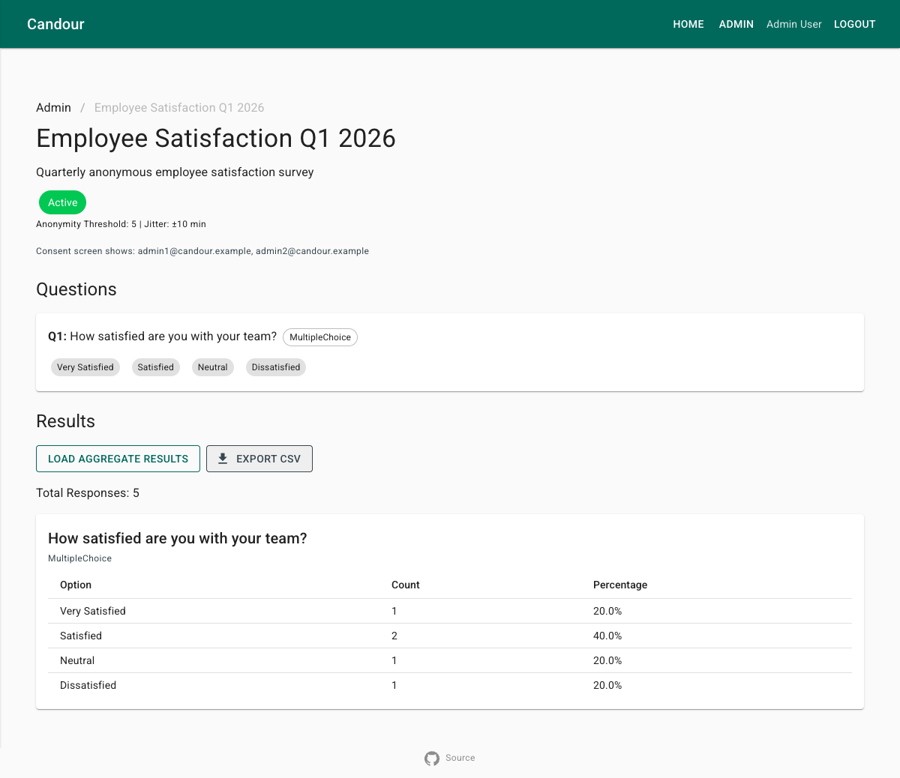
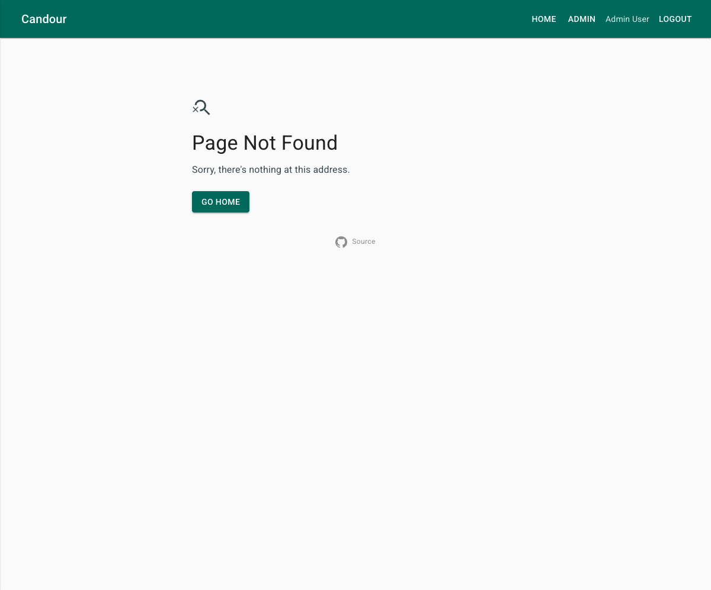

# User Journeys

End-to-end walkthrough of Candour's 11 core user journeys with screenshot evidence.

---

## Journey 0: Home Page & Navigation

**Goal:** Home page renders correctly for both unauthenticated and authenticated users.

### Unauthenticated

1. Navigate to `/`
2. Tagline, CTA, How It Works timeline, Privacy by Design cards all render
3. Nav bar shows Home and Login only

### Authenticated

1. Log in via Entra ID
2. Nav bar shows Home, Admin, user name, and Logout
3. "Go to Dashboard" CTA replaces "Get Started"

---

## Journey 1: Admin Creates a Survey

**Goal:** Survey builder creates a survey with multiple question types.

1. Navigate to `/admin` — dashboard shows existing surveys
2. Click **Create New Survey** to open the builder
3. Fill in title, description, anonymity threshold, and timestamp jitter
4. Add questions (multiple choice, free text, rating)
5. Click **Create Survey** — redirects to survey detail in Draft status

---

## Journey 2: Admin Publishes Survey & Gets Tokens

**Goal:** Publishing generates blind anonymity tokens with shareable one-time links.

1. From survey detail (Draft), click **Publish Survey**
2. Success card shows token count
3. Expand token list — each token is a full URL: `https://app.example/survey/{id}?t={token}`
4. **Copy All Links** button available for bulk distribution

---

## Journey 3: Consent Gate

**Goal:** Respondents see who has access to aggregate results before starting.

1. Navigate to `/survey/{id}?t={token}` with a valid, unused token
2. "Before you begin" consent card appears listing admin names
3. Anonymity assurance text explains what is and isn't collected
4. Click **I understand, begin survey** to proceed

---

## Journey 4: Respondent Submits Anonymous Response

**Goal:** Respondent completes and submits the survey anonymously.

### Survey Form

After passing the consent gate, the form loads with appropriate controls for each question type.

### Submission Success

Confirmation message: "Your anonymous response has been recorded." Token is consumed and cannot be reused.

### Invalid Survey or Token

Navigating with an invalid survey ID or token shows an error.

---

## Journey 5: Engineering Mode

**Goal:** After submission, engineering mode shows the exact data stored in Cosmos DB, proving no PII is saved.

1. With `EngineeringMode: true`, expand "What was actually stored" panel
2. JSON document contains only: `Id`, `SurveyId`, `Answers`, `SubmittedAt` (jittered)
3. "What was NOT stored" list: IP address, user agent, token value, respondent identity, cookies, headers

---

## Journey 6: Admin Views Aggregate Results

**Goal:** Admin views aggregate results, engagement metrics, and consent screen indicator.

### Survey Detail

Survey detail page shows status badge, consent screen indicator, question cards, and action buttons.

### Aggregate Results

Results table shows Option / Count / Percentage columns with total response count.

---

## Journey 7: Admin Exports CSV

**Goal:** CSV export works with anonymity threshold enforcement and CSPRNG row shuffling.

1. From survey detail with loaded results, click **Export CSV**
2. Browser downloads `export.csv` with rows in shuffled order (not submission order)

---

## Journey 8: Threshold Gate

**Goal:** Results are gated when response count is below the anonymity threshold.

1. Navigate to a survey with 0 responses (threshold: 5)
2. Click **Load Aggregate Results**
3. Warning: "Insufficient responses. Need 5, have 0."

---

## Journey 9: Token Reuse Prevention

**Goal:** A used token cannot submit a second response.

When a respondent navigates with a consumed token, validation rejects it. The survey form does not load.

**Mechanism:** Token hashes are stored in `usedTokens` on submission. There is no foreign key between `usedTokens` and `responses` — this architectural separation prevents correlation between token usage and specific responses.

---

## Journey 10: API Auth Enforcement

**Goal:** Admin endpoints reject unauthenticated requests.

| Endpoint | Method | Auth | Expected | Actual |
|----------|--------|------|----------|--------|
| `/api/surveys` | GET | None | 401 | 401 |
| `/api/surveys` | POST | None | 401 | 401 |
| `/api/surveys/{id}/results` | GET | None | 401 | 401 |
| `/api/surveys/{id}` | GET | None | 404 | 404 |
| `/api/surveys/{id}/validate-token` | POST | None | Reachable | Reachable |

Admin endpoints return 401 without a valid JWT. Public endpoints remain accessible.

---

## Journey 11: 404 Page

**Goal:** Unknown routes show a styled 404 page.

---

## Screenshot Inventory

| # | File | Journey | Description |
|---|------|---------|-------------|
| 1 | `home-page.png` | 0 | Home page (unauthenticated) |
| 2 | `home-page-authenticated.png` | 0 | Home page (authenticated) |
| 3 | `admin-dashboard.png` | 1 | Admin survey dashboard |
| 4 | `survey-builder.png` | 1 | Survey builder |
| 5 | `survey-detail-draft.png` | 1 | Survey detail (Draft) |
| 6 | `survey-published-tokens.png` | 2 | Token list |
| 7 | `consent-gate.png` | 3 | Consent gate |
| 8 | `survey-form.png` | 4 | Survey form |
| 9 | `survey-submitted.png` | 4 | Submission success |
| 10 | `survey-form-not-found.png` | 4 | Invalid survey/token |
| 11 | `engineering-mode.png` | 5 | Engineering mode |
| 12 | `survey-detail.png` | 6 | Survey detail (Active) |
| 13 | `aggregate-results.png` | 6 | Aggregate results |
| 14 | `csv-export.png` | 7 | CSV export |
| 15 | `threshold-gate.png` | 8 | Threshold gate |
| 16 | `404-page.png` | 11 | 404 page |
