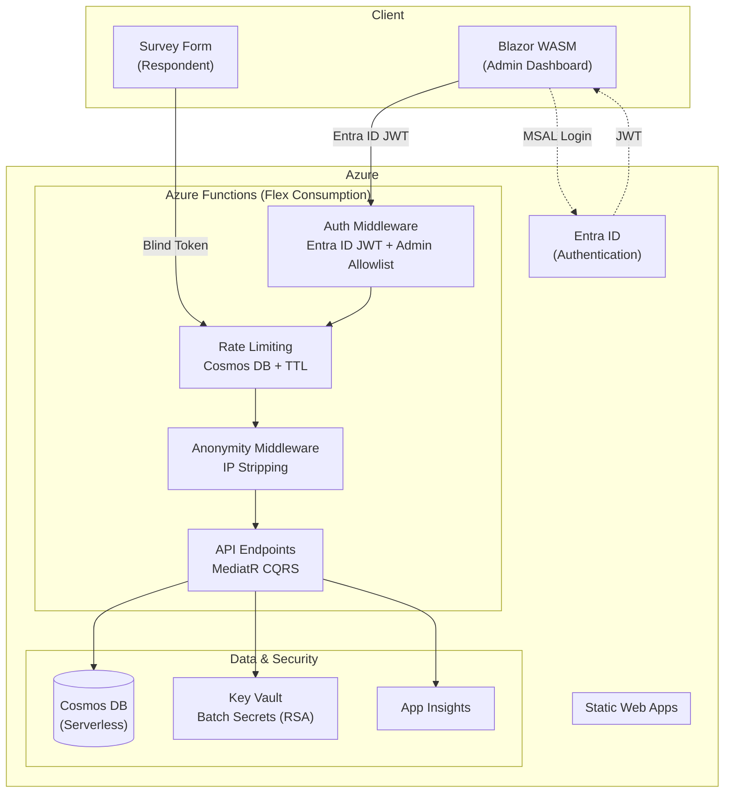

# Candour

**Truth needs no name.**

Candour is an open-source, anonymity-first survey platform built with .NET 9. Most survey tools treat anonymity as policy -- "we won't store your name." Candour treats it as architecture: the response data model has no identity fields to store.

---

## What is Candour?

Candour is a self-hosted survey tool designed for organizations that need honest, anonymous feedback. It runs on Azure serverless infrastructure and enforces respondent privacy through its data model and middleware pipeline -- not through promises or access controls alone.

Candour is built for teams that want to ask hard questions and trust the answers.

---

## Key Features

### Anonymity by Design

| Feature | Description |
|---------|-------------|
| **Zero-PII responses** | Response records contain no identity fields -- there is nothing to leak |
| **Blind tokens** | HMAC-SHA256 tokens prevent duplicate submissions without linking responses to respondents |
| **IP stripping** | Middleware removes all IP-related headers before any handler processes the request |
| **Timestamp jitter** | Configurable random offset applied to submission timestamps before storage |
| **Threshold gating** | Results are only available after a minimum response count is reached |
| **Aggregate-only results** | No API endpoint returns individual response data |

### Transparency and Administration

| Feature | Description |
|---------|-------------|
| **Engineering mode** | After submission, respondents see the exact Cosmos DB document stored and an explicit list of what was *not* stored (IP, user agent, token, identity, cookies) |
| **Consent gate** | Respondents see who has access to aggregate results before starting the survey |
| **CSV export** | Admin export of response data with CSPRNG row shuffling and anonymity threshold enforcement |
| **Rate limiting** | Cosmos DB-backed distributed rate limiting on public endpoints with TTL auto-cleanup |

!!! info "Admin Access"
    Aggregate results and export endpoints require authenticated admin authorization via Entra ID JWT. Admin routes are never exposed to unauthenticated users in production.

---

## Architecture

**Admin routes** (`/api/surveys`, `.../publish`, `.../analyze`, `.../results`, `.../export`) require Entra ID JWT or API key.

**Public routes** (`/api/surveys/{id}`, `.../validate-token`) are unauthenticated. Response submission (`POST .../responses`) uses blind tokens for anonymous access.

---

## Tech Stack

| Component | Technology | Role |
|-----------|-----------|------|
| **Backend** | .NET 9, Azure Functions (isolated worker) | API, middleware pipeline, CQRS handlers |
| **Frontend** | Blazor WebAssembly, MudBlazor | Admin dashboard and respondent survey forms |
| **Database** | Azure Cosmos DB (serverless) | Document storage for surveys, responses, tokens, rate limits |
| **Authentication** | Entra ID, MSAL | JWT bearer auth for admin operations |
| **Command/Query** | MediatR | CQRS command/query separation |
| **Infrastructure** | Bicep IaC, GitHub Actions | Automated provisioning and CI/CD |

---

## Estimated Azure Costs

Candour runs on Azure serverless and free tiers. At low-to-moderate usage (a few surveys with hundreds of respondents), the monthly cost is minimal.

| Service | SKU | Estimated Monthly Cost |
|---------|-----|----------------------|
| **Azure Functions** | Flex Consumption (FC1) | ~$0 (first 1M executions free) |
| **Cosmos DB** | Serverless | ~$0.25--$1 per 1M RUs consumed |
| **Static Web Apps** | Free | $0 |
| **Key Vault** | Standard | ~$0.03 per 10K operations |
| **Application Insights** | Pay-as-you-go (5 GB/month free) | ~$0 at low volume |
| **Log Analytics** | Pay-as-you-go (5 GB/month free) | ~$0 at low volume |
| **Storage Account** | Standard LRS | ~$0.02/GB (Functions runtime only) |

!!! tip "Small Deployment Estimate"
    Less than **$1/month** for a typical small deployment. No always-on compute -- you pay for actual usage only.

---

## Quick Links

-   **Getting Started**

    ---

    Set up Candour locally in under five minutes.

    [:octicons-arrow-right-24: Quick Start](getting-started/quickstart.md)

-   **API Reference**

    ---

    Full endpoint documentation for surveys, responses, and results.

    [:octicons-arrow-right-24: API Overview](api/overview.md)

-   **Security & Privacy**

    ---

    Anonymity architecture, threat model, and blind token scheme.

    [:octicons-arrow-right-24: Anonymity Architecture](security/anonymity.md)

-   **Deployment**

    ---

    Azure deployment guide with Bicep IaC and CI/CD pipeline.

    [:octicons-arrow-right-24: Deployment Guide](deployment/guide.md)

---

## License

Candour is released under the [MIT License](https://github.com/asachs/candour/blob/master/LICENSE).
