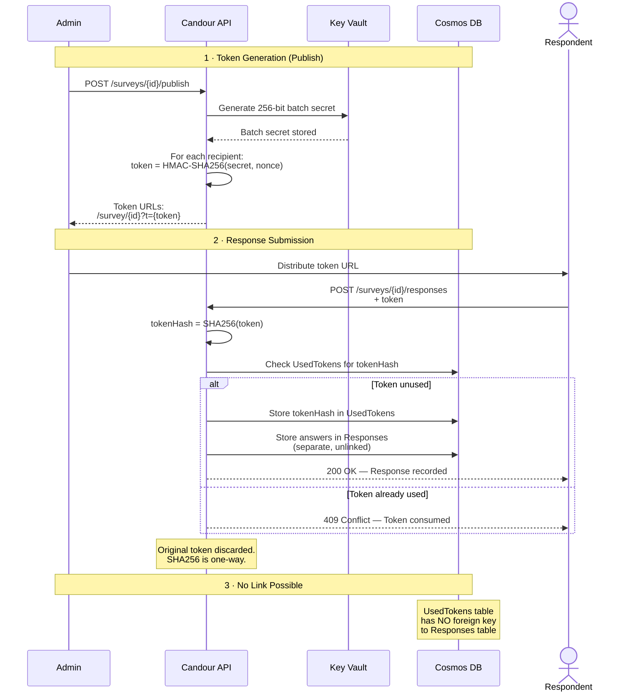

# Blind Token Scheme

Candour uses a blind token scheme to authorize survey responses without creating any link between the respondent's identity and their answers. The token proves the respondent was invited to participate. It does not identify who they are.

## How It Works



## The Three Phases

### Phase 1: Token Generation

When an admin publishes a survey, the system generates tokens for distribution.

1. The API requests a 256-bit batch secret from Azure Key Vault.
2. For each intended recipient, the API computes `HMAC-SHA256(batchSecret, random_nonce)` to produce a unique token.
3. The tokens are returned to the admin as URLs in the format `https://app.candour.example/survey/{id}?t={token}`.

!!! info "Why HMAC-SHA256"
    HMAC-SHA256 produces tokens that are computationally indistinguishable from random data. An attacker who obtains one token cannot derive the batch secret or compute other tokens. The batch secret never leaves Key Vault after generation.

### Phase 2: Response Submission

When a respondent submits their answers, the token is consumed.

1. The respondent sends `POST /surveys/{id}/responses` with their token.
2. The server computes `SHA256(token)` to produce a one-way hash.
3. The server checks the `UsedTokens` table for this hash.
4. If the hash is absent, the server stores the hash in `UsedTokens` and stores the answers in `Responses` as two separate, unlinked operations.
5. If the hash is already present, the server returns `409 Conflict`.
6. The original token is discarded. It is never stored.

!!! warning "The original token is never persisted"
    The server computes `SHA256(token)` and immediately discards the original token. SHA256 is a one-way function -- the token cannot be recovered from the hash. Even with full database access, an attacker cannot determine what token was used for any given hash.

### Phase 3: No Link Possible

After submission, there is no way to connect a used token to its corresponding response.

The `UsedTokens` table stores `TokenHash` and `SurveyId`. The `Responses` table stores `Id`, `SurveyId`, `Answers`, and `SubmittedAt`. There is no foreign key, no shared identifier, and no join path between these tables.

!!! danger "This separation is deliberate"
    The absence of a foreign key between `UsedTokens` and `Responses` is not an oversight. It is the core anonymity mechanism. Even the system itself cannot determine which token produced which response.

## Cryptographic Choices

### Token Generation: HMAC-SHA256

HMAC-SHA256 is used to derive tokens from the batch secret and a random nonce. This choice provides:

- **Unforgeability** -- Without the batch secret, valid tokens cannot be generated.
- **Independence** -- Each token is derived from a unique nonce. Knowing one token reveals nothing about others.
- **Determinism** -- The same secret and nonce always produce the same token, enabling verification without storing tokens.

### Token Storage: SHA256 One-Way Hash

On submission, the token is hashed with SHA256 before storage. This choice provides:

- **Irreversibility** -- The original token cannot be recovered from the hash.
- **Collision resistance** -- Two different tokens will not produce the same hash.
- **Efficiency** -- SHA256 is fast enough for real-time validation without becoming a brute-force enabler (rate limiting handles that separately).

## Why No Foreign Key

The `UsedToken` entity:

```csharp
public class UsedToken
{
    public string TokenHash { get; set; } // SHA256(token), primary key
    public Guid SurveyId { get; set; }
}
```

The `SurveyResponse` entity:

```csharp
public class SurveyResponse
{
    public Guid Id { get; set; }       // Random UUID
    public Guid SurveyId { get; set; }
    public string Answers { get; set; } // JSON
    public DateTime SubmittedAt { get; set; } // Jittered
    // DELIBERATELY NO: RespondentId, IpAddress, UserAgent, TokenReference
}
```

Both entities share `SurveyId`, but this only identifies the survey -- not the respondent. Within a survey, there is no column that could join a specific token hash to a specific response. This is the structural guarantee: even a database administrator with full access cannot link tokens to responses.

!!! example "What a database query reveals"
    An admin can query "which token hashes have been used for survey X" and "what responses exist for survey X." They cannot determine which hash corresponds to which response. The two result sets are independent.
