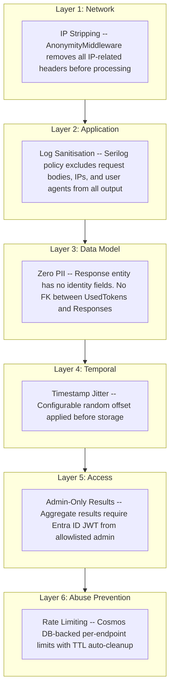
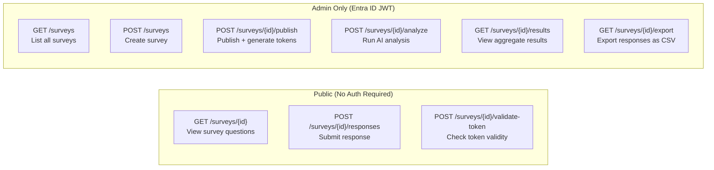

# Threat Model

Candour's anonymity design addresses six attack vectors through layered defences. Each layer operates independently so that a failure in one does not compromise the others.

## Defence Layers

## Attack Vectors

### 1. Database Breach

An attacker gains read access to the Cosmos DB database.

!!! note "Mitigation: Zero-PII data model (Layer 3)"
    `SurveyResponse` records contain only `Id`, `SurveyId`, `Answers`, and `SubmittedAt`. There are no identity fields -- no respondent ID, no IP address, no user agent, no token reference. Individual responses cannot be attributed to any person because the data to do so does not exist.

### 2. Server-Side Correlation

An operator or insider attempts to link a response to the respondent who submitted it by joining database tables.

!!! note "Mitigation: No foreign key relationship (Layer 3)"
    The `UsedTokens` table and the `Responses` table have no foreign key between them. The system itself cannot determine which token produced which response. These tables are structurally isolated -- there is no column to join on.

### 3. Timing Analysis

An attacker who knows when a specific person submitted their response attempts to match that timestamp against stored records.

!!! note "Mitigation: Timestamp jitter (Layer 4)"
    A configurable random offset (default +/- 10 minutes) is applied to `SubmittedAt` before storage. The stored timestamp does not reflect the actual submission time, making ordering correlation unreliable.

### 4. Network-Level Identification

An attacker with access to network logs or server request data attempts to match IP addresses to survey submissions.

!!! note "Mitigation: IP stripping (Layer 1)"
    `AnonymityMiddleware` removes all IP-related headers before any handler processes the request. The stripped headers include `X-Forwarded-For`, `X-Real-IP`, `X-Forwarded-Host`, `X-Client-IP`, `CF-Connecting-IP`, and `True-Client-IP`. Response headers are also sanitised -- `Set-Cookie` is stripped from respondent-facing routes.

### 5. Log Analysis

An attacker with access to application logs attempts to correlate log entries with survey submissions.

!!! note "Mitigation: Log sanitisation (Layer 2)"
    A Serilog destructuring policy excludes request bodies, IP addresses, and user agents from all log output. Even with full log access, there is no identity data to correlate.

### 6. Brute-Force and Enumeration

An attacker attempts to guess valid tokens, enumerate existing tokens, or scrape survey data through automated requests.

!!! note "Mitigation: Distributed rate limiting (Layer 6)"
    Per-endpoint rate limits backed by Cosmos DB counters prevent token brute-force, token enumeration, and survey scraping. Counters persist across scale-to-zero events using TTL-based auto-cleanup.

## Access Control Boundary

Not all endpoints are public. The API enforces a strict boundary between respondent-facing routes and admin routes.

Admin authentication requires an Entra ID JWT from an allowlisted email address. Aggregate data is only visible to authorized admins.

## Residual Risks

No threat model eliminates all risk. The following residual risks are acknowledged and accepted.

!!! warning "Small response pools"
    When a survey has very few respondents, free-text answers may contain enough context to identify the author through writing style or domain-specific knowledge. The anonymity threshold gate mitigates this for aggregate results and exports, but it cannot prevent a respondent from writing self-identifying content.

!!! warning "Client-side observation"
    If an attacker has physical or remote access to the respondent's device, they can observe the submission directly. This is outside the server-side threat model.

!!! warning "Token distribution channel"
    Candour generates anonymous tokens but does not control how they are distributed. If an admin distributes tokens in a way that maps tokens to individuals (e.g., sending each token in a personally addressed email and keeping a copy), the admin could correlate tokens with recipients. The blind token scheme prevents the **server** from making this correlation, but cannot prevent an admin from keeping their own external records.

!!! warning "Timing side-channels at the network edge"
    Timestamp jitter protects stored data, but an attacker with access to network edge logs (load balancer, CDN) could observe the actual request time. The `AnonymityMiddleware` strips IP headers but cannot prevent the network infrastructure from logging request metadata at layers below the application.

!!! warning "Future schema changes"
    The structural anonymity guarantee holds as long as the `SurveyResponse` entity contains no identity fields. A future code change that adds such fields would break the guarantee. This risk is mitigated by code review, but ultimately depends on development discipline.
