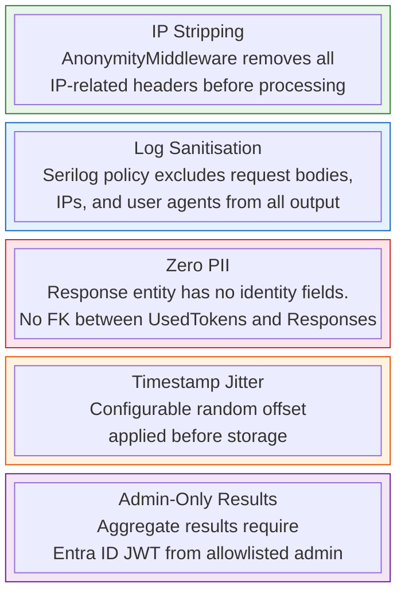
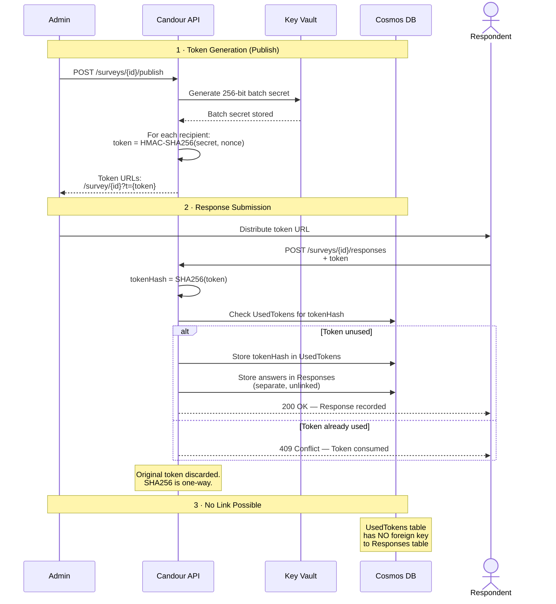
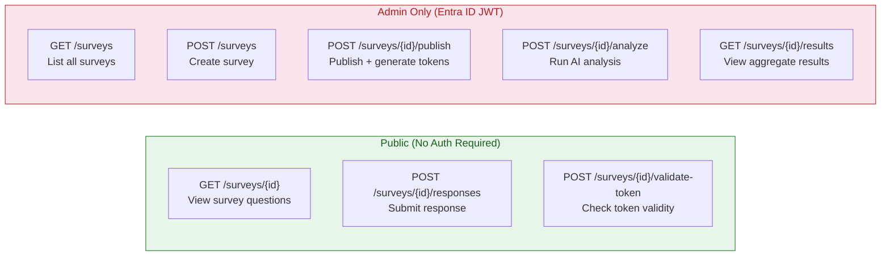

# Anonymity Architecture

## Threat Model

Candour's anonymity design addresses five attack vectors through layered defences:

1. **Database breach** — Attacker gains read access to the database. Response records contain zero PII fields, so individual responses cannot be attributed.

2. **Server-side correlation** — The system itself cannot link responses to respondents. UsedTokens and Responses tables have no foreign key relationship.

3. **Timing analysis** — Configurable timestamp jitter (default +/-10 minutes) prevents ordering correlation.

4. **Network-level identification** — AnonymityMiddleware strips IP addresses and related headers before any handler processes the request.

5. **Log analysis** — Serilog destructuring policy excludes request bodies, IP addresses, and user agents from all log output.

## Blind Token Scheme

1. Survey creator publishes — system generates 256-bit batch secret in Key Vault
2. Tokens generated: `HMAC-SHA256(batchSecret, random_nonce)`
3. On submission: server computes `SHA256(token)`, checks UsedTokens
4. If hash absent — store hash in UsedTokens, store answers in Responses (separate, unlinked)
5. Original token discarded — SHA256 is one-way

## Design decision: structural vs policy anonymity

Policy-based anonymity relies on configuration to exclude identity data. A code change, misconfiguration, or database join can defeat it.

Candour's Response entity has no fields for identity data. Adding PII to responses requires modifying the database schema — it cannot happen through normal API usage.

## Access Control

Aggregate results are only accessible to authenticated admin users. The API enforces this via middleware:

Admin authentication requires an Entra ID JWT from an allowlisted email address. Aggregate data is only visible to authorized admins.
