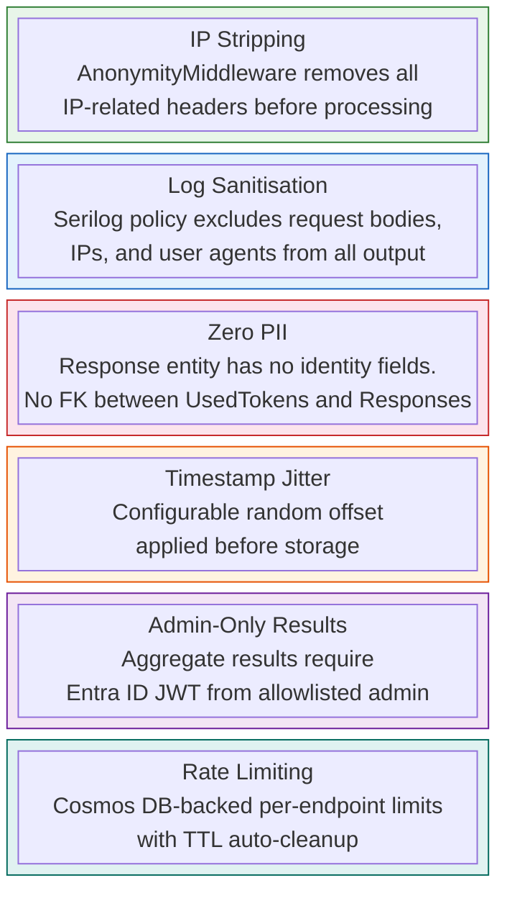
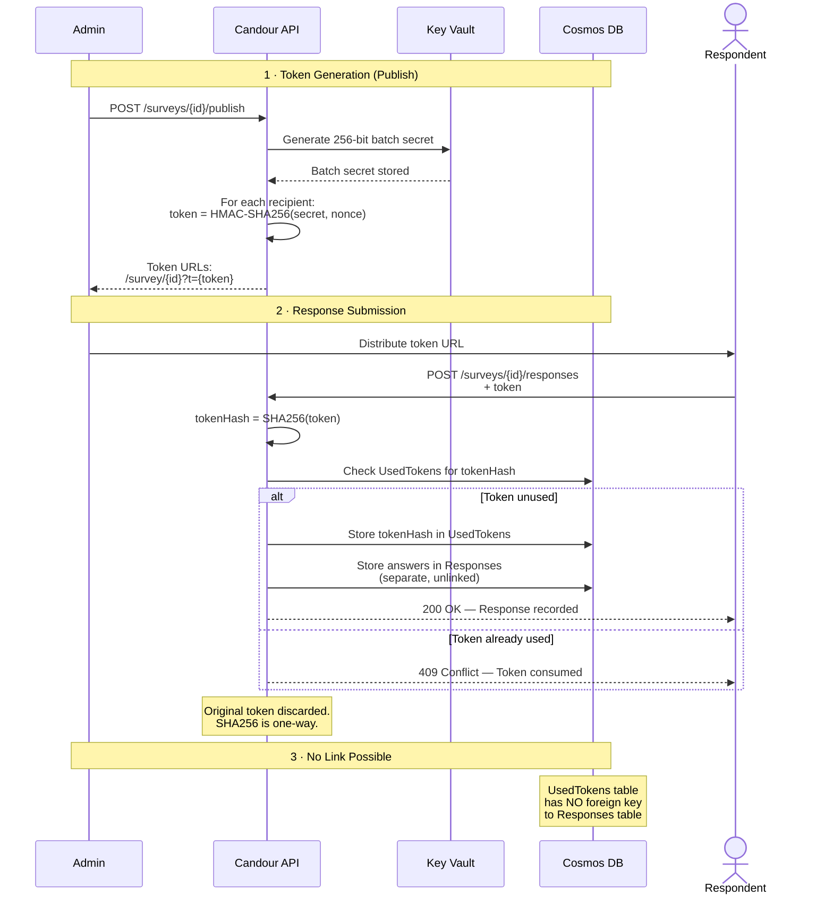
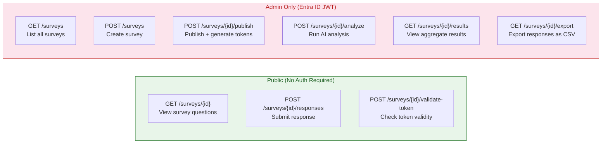

# Anonymity Architecture

## Threat Model

Candour's anonymity design addresses six attack vectors through layered defences:


```mermaid
block-beta
  columns 1
  block:L1["Layer 1: Network"]
    A["IP Stripping<br/>AnonymityMiddleware removes all<br/>IP-related headers before processing"]
  end
  block:L2["Layer 2: Application"]
    B["Log Sanitisation<br/>Serilog policy excludes request bodies,<br/>IPs, and user agents from all output"]
  end
  block:L3["Layer 3: Data Model"]
    C["Zero PII<br/>Response entity has no identity fields.<br/>No FK between UsedTokens and Responses"]
  end
  block:L4["Layer 4: Temporal"]
    D["Timestamp Jitter<br/>Configurable random offset<br/>applied before storage"]
  end
  block:L5["Layer 5: Access"]
    E["Admin-Only Results<br/>Aggregate results require<br/>Entra ID JWT from allowlisted admin"]
  end
  block:L6["Layer 6: Abuse Prevention"]
    F["Rate Limiting<br/>Cosmos DB-backed per-endpoint limits<br/>with TTL auto-cleanup"]
  end

  style L1 fill:#e8f5e9,stroke:#2e7d32,color:#1b5e20
  style L2 fill:#e3f2fd,stroke:#1565c0,color:#0d47a1
  style L3 fill:#fce4ec,stroke:#c62828,color:#b71c1c
  style L4 fill:#fff3e0,stroke:#e65100,color:#bf360c
  style L5 fill:#f3e5f5,stroke:#6a1b9a,color:#4a148c
  style L6 fill:#e0f2f1,stroke:#00695c,color:#004d40
```

1. **Database breach** — Attacker gains read access to the database. Response records contain zero PII fields, so individual responses cannot be attributed.

2. **Server-side correlation** — The system itself cannot link responses to respondents. UsedTokens and Responses tables have no foreign key relationship.

3. **Timing analysis** — Configurable timestamp jitter (default +/-10 minutes) prevents ordering correlation.

4. **Network-level identification** — AnonymityMiddleware strips IP addresses and related headers before any handler processes the request.

5. **Log analysis** — Serilog destructuring policy excludes request bodies, IP addresses, and user agents from all log output.

6. **Brute-force / enumeration** — Distributed rate limiting on public endpoints prevents token brute-force, token enumeration, and survey scraping. Cosmos DB-backed counters persist across scale-to-zero events. See [Rate Limiting Design](DESIGN-RATE-LIMITING.md).

## Blind Token Scheme


```mermaid
sequenceDiagram
    participant Admin
    participant API as Candour API
    participant KV as Key Vault
    participant DB as Cosmos DB

    Note over Admin,DB: 1 · Token Generation (Publish)
    Admin->>API: POST /surveys/{id}/publish
    API->>KV: Generate 256-bit batch secret
    KV-->>API: Batch secret stored
    API->>API: For each recipient:<br/>token = HMAC-SHA256(secret, nonce)
    API-->>Admin: Token URLs:<br/>/survey/{id}?t={token}

    Note over Admin,DB: 2 · Response Submission
    Actor R as Respondent
    Admin->>R: Distribute token URL
    R->>API: POST /surveys/{id}/responses<br/>+ token
    API->>API: tokenHash = SHA256(token)
    API->>DB: Check UsedTokens for tokenHash
    alt Token unused
        API->>DB: Store tokenHash in UsedTokens
        API->>DB: Store answers in Responses<br/>(separate, unlinked)
        API-->>R: 200 OK — Response recorded
    else Token already used
        API-->>R: 409 Conflict — Token consumed
    end
    Note over API: Original token discarded.<br/>SHA256 is one-way.

    Note over Admin,DB: 3 · No Link Possible
    Note over DB: UsedTokens table<br/>has NO foreign key<br/>to Responses table
```

1. Survey creator publishes — system generates 256-bit batch secret in Key Vault
2. Tokens generated: `HMAC-SHA256(batchSecret, random_nonce)`
3. On submission: server computes `SHA256(token)`, checks UsedTokens
4. If hash absent — store hash in UsedTokens, store answers in Responses (separate, unlinked)
5. Original token discarded — SHA256 is one-way

## Engineering Mode: Proving Anonymity to Respondents

Candour doesn't just claim anonymity — it proves it. When engineering mode is enabled, respondents see the exact Cosmos DB document stored after submission:

```json
{
  "Id": "a1b2c3d4-...",
  "SurveyId": "e5f6g7h8-...",
  "Answers": "{\"q1\":\"Yes\",\"q2\":\"Great team\"}",
  "SubmittedAt": "2026-03-02T10:15:00Z"
}
```

Alongside the stored document, an explicit list shows what was **not** stored: IP address, user agent, survey token, respondent identity, and cookies. This transparency is safe because the `SurveyResponse` entity contains zero identity fields by design.

Controlled by the `EngineeringMode` configuration key (default: `true`).

## Design decision: structural vs policy anonymity

Policy-based anonymity relies on configuration to exclude identity data. A code change, misconfiguration, or database join can defeat it.

Candour's Response entity has no fields for identity data. Adding PII to responses requires modifying the database schema — it cannot happen through normal API usage.

## CSV Export

Admins can export response data as CSV via `GET /api/surveys/{id}/export`. The export preserves all anonymity guarantees:

- **Threshold gate** — Export is blocked until the anonymity threshold is met (same rule as aggregate results)
- **Row shuffling** — Responses are shuffled using CSPRNG before CSV generation, preventing ordering correlation
- **Zero PII columns** — The CSV contains only question answers and jittered timestamps. No identity fields exist to export.

The export endpoint is protected by the same admin authentication middleware as all other admin routes.

## Access Control

Aggregate results and exports are only accessible to authenticated admin users. The API enforces this via middleware:


```mermaid
flowchart LR
    subgraph Public["Public (No Auth Required)"]
        direction TB
        A["GET /surveys/{id}<br/>View survey questions"]
        B["POST /surveys/{id}/responses<br/>Submit response"]
        C["POST /surveys/{id}/validate-token<br/>Check token validity"]
    end

    subgraph Admin["Admin Only (Entra ID JWT)"]
        direction TB
        D["GET /surveys<br/>List all surveys"]
        E["POST /surveys<br/>Create survey"]
        F["POST /surveys/{id}/publish<br/>Publish + generate tokens"]
        G["POST /surveys/{id}/analyze<br/>Run AI analysis"]
        H["GET /surveys/{id}/results<br/>View aggregate results"]
        I["GET /surveys/{id}/export<br/>Export responses as CSV"]
    end

    style Public fill:#e8f5e9,stroke:#2e7d32,color:#1b5e20
    style Admin fill:#fce4ec,stroke:#c62828,color:#b71c1c
```

Admin authentication requires an Entra ID JWT from an allowlisted email address. Aggregate data is only visible to authorized admins.
