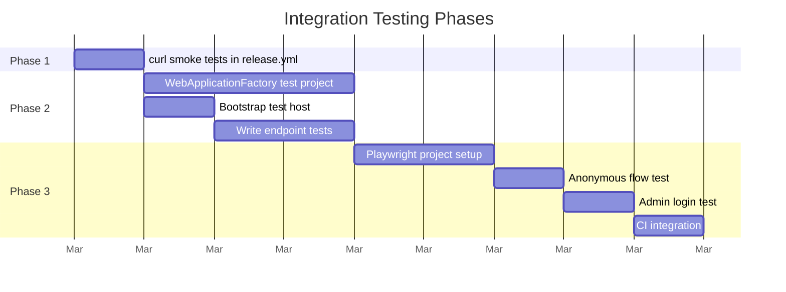

# Design: Integration Testing Strategy

## Summary

Add three tiers of integration testing to Candour's CI/CD pipeline, each catching a different class of defect. All three tiers are free to run on GitHub Actions.

| Phase | What | Catches | When |
|-------|------|---------|------|
| **1. curl smoke tests** | HTTP calls to live deployment | Infrastructure misconfig, deployment failures, CORS | Post-deploy in `release.yml` |
| **2. WebApplicationFactory tests** | In-process API testing with mocked Cosmos | Handler regressions, middleware bugs, auth logic | Pre-deploy in `ci.yml` |
| **3. Playwright browser tests** | Full browser automation against live SWA | UI regressions, Blazor rendering, auth flows | Post-deploy in `release.yml` |

## Current Test Coverage

Candour has 6 unit test projects covering handlers, entities, middleware regex, crypto, document mapping, and anonymity contracts. All run via `dotnet test` in CI.

**Gap:** No tests verify that a deployed instance actually works. A successful `dotnet build` does not catch:
- Missing app settings in production
- Cosmos DB container misconfiguration
- CORS policy blocking the frontend
- Entra ID token validation with real OIDC metadata
- Blazor WASM loading and rendering

---

## Phase 1: curl Smoke Tests (Post-Deploy)

### Scope

Verify that deployed API endpoints respond with expected HTTP status codes. Runs in `release.yml` after the `release` job creates the GitHub Release.

### Endpoints to Test

| # | Method | Endpoint | Expected | Auth |
|---|--------|----------|----------|------|
| 1 | `GET` | `/api/surveys/{id}` | 404 (survey doesn't exist, but endpoint is reachable) | None |
| 2 | `POST` | `/api/surveys/{id}/validate-token` | 200 `{"valid":false}` | None |
| 3 | `GET` | `/api/surveys` | 401 Unauthorized | None (verifies auth gate) |
| 4 | `POST` | `/api/surveys` | 401 Unauthorized | None (verifies auth gate) |
| 5 | `GET` | `/api/surveys/{id}/results` | 401 Unauthorized | None (verifies auth gate) |

Tests 1–2 confirm public endpoints are reachable. Tests 3–5 confirm admin endpoints reject unauthenticated requests.

### Workflow Addition

Add a `smoke-test` job to `release.yml`:

```yaml
smoke-test:
  needs: release
  runs-on: ubuntu-latest
  steps:
    - name: Wait for deployment propagation
      run: sleep 30

    - name: Smoke test public endpoints
      env:
        API_BASE: ${{ vars.API_BASE_URL }}
      run: |
        set -euo pipefail
        FAKE_ID="00000000-0000-0000-0000-000000000000"

        echo "=== Public Endpoints ==="
        STATUS=$(curl -s -o /dev/null -w "%{http_code}" "$API_BASE/api/surveys/$FAKE_ID")
        [ "$STATUS" = "404" ] || { echo "FAIL: GET /surveys/{id} returned $STATUS, expected 404"; exit 1; }
        echo "PASS: GET /surveys/{id} → $STATUS"

        STATUS=$(curl -s -o /dev/null -w "%{http_code}" \
          -X POST -H "Content-Type: application/json" \
          -d "{\"token\":\"fake\"}" \
          "$API_BASE/api/surveys/$FAKE_ID/validate-token")
        [ "$STATUS" = "200" ] || { echo "FAIL: POST /validate-token returned $STATUS, expected 200"; exit 1; }
        echo "PASS: POST /validate-token → $STATUS"

        echo "=== Admin Endpoints (expect 401) ==="
        for ENDPOINT in "api/surveys" "api/surveys/$FAKE_ID/results"; do
          STATUS=$(curl -s -o /dev/null -w "%{http_code}" "$API_BASE/$ENDPOINT")
          [ "$STATUS" = "401" ] || { echo "FAIL: GET /$ENDPOINT returned $STATUS, expected 401"; exit 1; }
          echo "PASS: GET /$ENDPOINT → $STATUS"
        done

        echo "All smoke tests passed."
```

### Configuration

- `API_BASE_URL` stored as a GitHub Actions **repository variable** (not a secret — it's the public API URL)
- No secrets required — tests only hit public endpoints or verify 401 on admin endpoints
- 30-second delay accounts for Azure Functions cold start after deployment

### Limitations

- Does not test authenticated admin flows (would require storing Entra ID credentials)
- Does not test response bodies beyond status codes (use `jq` for JSON validation if needed later)
- Does not test the frontend (SWA)

---

## Phase 2: WebApplicationFactory Integration Tests (Pre-Deploy)

### Scope

Test the Functions API in-process with mocked Cosmos DB. Catches handler logic regressions, middleware behavior, and DI wiring issues before deployment.

### Challenge: Azure Functions Isolated Worker

Azure Functions isolated worker does not support `WebApplicationFactory<T>` out of the box. The host is a `FunctionsApplication`, not an ASP.NET Core `WebApplication`.

### Approach: Host Builder Bootstrap

Create a test host that mirrors `Program.cs` but replaces external dependencies:

```
Production:     CosmosClient → Cosmos DB (Azure)
Test:           Mock<ISurveyRepository> → In-memory test data
```

This reuses the existing unit test pattern (Moq'd repositories) but adds the middleware pipeline, so requests flow through `AuthenticationMiddleware` → `AnonymityMiddleware` → handler.

### Test Project

Create `tests/Candour.Functions.Integration.Tests/`:

```
tests/Candour.Functions.Integration.Tests/
├── Candour.Functions.Integration.Tests.csproj
├── TestFunctionHost.cs          ← Bootstraps isolated worker host with mocks
├── SurveyEndpointTests.cs       ← GET/POST /surveys
├── ResponseEndpointTests.cs     ← POST /responses, validate-token
├── AuthMiddlewareTests.cs       ← 401 enforcement on admin routes
└── AnonymityMiddlewareTests.cs  ← Header stripping verification
```

### TestFunctionHost

```csharp
public class TestFunctionHost : IAsyncLifetime
{
    private IHost _host;
    private HttpClient _client;

    public HttpClient Client => _client;
    public Mock<ISurveyRepository> SurveyRepo { get; } = new();
    public Mock<IResponseRepository> ResponseRepo { get; } = new();
    public Mock<IUsedTokenRepository> UsedTokenRepo { get; } = new();

    public async Task InitializeAsync()
    {
        _host = new HostBuilder()
            .ConfigureFunctionsWebApplication()
            .ConfigureServices(services =>
            {
                services.AddApplication();  // MediatR handlers
                services.AddSingleton(SurveyRepo.Object);
                services.AddSingleton(ResponseRepo.Object);
                services.AddSingleton(UsedTokenRepo.Object);
                services.AddSingleton<IJwtTokenValidator, NoOpJwtTokenValidator>();
                services.Configure<EntraIdOptions>(o => o.UseEntraId = false);
            })
            .Build();

        await _host.StartAsync();
        _client = new HttpClient { BaseAddress = new Uri("http://localhost:7071") };
    }

    public async Task DisposeAsync()
    {
        _client.Dispose();
        await _host.StopAsync();
    }
}
```

**Note:** The exact host bootstrap depends on `Microsoft.Azure.Functions.Worker` test support in .NET 9. If the isolated worker host doesn't expose an HTTP listener, fall back to `Azure.Functions.Testing` NuGet or invoke handlers directly via MediatR (bypassing HTTP but testing the full handler + middleware chain).

### Test Cases

| Test | Endpoint | Setup | Assert |
|------|----------|-------|--------|
| Get survey returns questions | `GET /surveys/{id}` | Mock returns survey with 3 questions | 200 + JSON with `questions[]` |
| Get missing survey returns 404 | `GET /surveys/{id}` | Mock returns null | 404 |
| Submit response with valid token | `POST /surveys/{id}/responses` | Mock active survey, valid token | 200 |
| Submit response with used token | `POST /surveys/{id}/responses` | Mock `ExistsAsync` returns true | 409 |
| Admin list requires auth | `GET /surveys` | No auth header | 401 |
| Admin list with API key | `GET /surveys` | `X-Api-Key` header | 200 |
| Anonymity strips IP header | `POST /surveys/{id}/responses` | Set `X-Forwarded-For` | Response processed, header absent from handler context |
| Threshold gate blocks results | `GET /surveys/{id}/results` | Mock 1 response, threshold 5 | 200 + error message |

### CI Integration

Add to `ci.yml` — runs alongside existing unit tests:

```yaml
- run: dotnet test --no-build --verbosity normal
```

No change needed — `dotnet test` at the solution level discovers all test projects automatically.

### Limitations

- Tests run against mocked repositories, not real Cosmos DB
- Cannot catch Cosmos-specific bugs (serialization, partition key mismatches)
- Host bootstrap may require adaptation as Azure Functions SDK evolves

---

## Phase 3: Playwright Browser Tests (Post-Deploy)

### Scope

Full end-to-end browser tests against the live Static Web App and API. Tests the Blazor WASM frontend, Entra ID authentication, and the complete respondent flow.

### Prerequisites

- A **test Entra ID user** in the tenant (e.g., `test-admin@yourdomain.onmicrosoft.com`)
- Password authentication enabled for that user (not MFA-only)
- A **seeded test survey** in the deployed environment (or create one as part of the test)
- Credentials stored in GitHub Actions secrets

### Test Project

Use `@playwright/test` (TypeScript) rather than .NET Playwright, since the tests run against a deployed URL (not in-process).

```
tests/e2e/
├── package.json
├── playwright.config.ts
├── tests/
│   ├── anonymous-survey.spec.ts    ← Respondent flow
│   ├── admin-dashboard.spec.ts     ← Admin login + dashboard
│   ├── auth-enforcement.spec.ts    ← Verify redirect to login
│   └── 404-page.spec.ts            ← Not Found page
└── .env.example
```

### Test Scenarios

#### 1. Anonymous Survey Submission

```
1. Navigate to /survey/{testSurveyId}?t={testToken}
2. Assert survey title visible
3. Select radio button for multiple choice question
4. Fill free text question
5. Click "Submit Anonymously"
6. Assert success message: "Your anonymous response has been recorded"
```

**Requires:** A pre-seeded active survey with unused tokens. The test consumes a token on each run — either generate fresh tokens or re-publish the survey in a setup step.

#### 2. Admin Login and Dashboard

```
1. Navigate to /admin
2. Assert redirect to Entra ID login
3. Fill email, click Next
4. Fill password, click Sign in
5. Assert redirect back to /admin
6. Assert survey table visible with at least one row
```

**Requires:** `TEST_ADMIN_EMAIL` and `TEST_ADMIN_PASSWORD` in GitHub secrets.

#### 3. Auth Enforcement

```
1. Navigate to /admin (not logged in)
2. Assert redirect to /authentication/login
3. Navigate to /admin/builder
4. Assert redirect to /authentication/login
```

#### 4. 404 Page

```
1. Navigate to /nonexistent-page
2. Assert "Page Not Found" heading visible
3. Assert "Go Home" button visible
```

### Workflow Addition

Add a `e2e-test` job to `release.yml`:

```yaml
e2e-test:
  needs: release
  runs-on: ubuntu-latest
  steps:
    - uses: actions/checkout@v4

    - uses: actions/setup-node@v4
      with:
        node-version: '20'

    - name: Install Playwright
      working-directory: tests/e2e
      run: |
        npm ci
        npx playwright install chromium --with-deps

    - name: Run E2E tests
      working-directory: tests/e2e
      env:
        BASE_URL: ${{ vars.SWA_BASE_URL }}
        TEST_ADMIN_EMAIL: ${{ secrets.TEST_ADMIN_EMAIL }}
        TEST_ADMIN_PASSWORD: ${{ secrets.TEST_ADMIN_PASSWORD }}
        TEST_SURVEY_ID: ${{ vars.TEST_SURVEY_ID }}
      run: npx playwright test

    - name: Upload test artifacts
      if: failure()
      uses: actions/upload-artifact@v4
      with:
        name: playwright-report
        path: tests/e2e/playwright-report/
        retention-days: 7
```

### Entra ID Login in Headless Browser

Entra ID's login page works in headless Chromium. The selectors for the Microsoft login form:

```typescript
await page.fill('input[name="loginfmt"]', email);
await page.click('input[type="submit"]');
await page.fill('input[name="passwd"]', password);
await page.click('input[type="submit"]');
// Handle "Stay signed in?" prompt
await page.click('input[value="No"]');
```

**Risk:** Microsoft periodically changes the login page DOM. Pin Playwright version and update selectors when tests break.

### Limitations

- Consumes real tokens on each run (need token refresh strategy)
- Entra ID login selectors are fragile
- Blazor WASM cold load takes 5–15 seconds (set generous timeouts)
- Tests against live infrastructure — flaky if Azure has an outage
- Requires maintaining test user credentials

---

## Implementation Order



Phase 1 provides immediate value (30 minutes of work). Phase 2 catches most regressions pre-deploy. Phase 3 is optional — implement only if UI bugs recur.

### Implementation Status

- **Phase 2:** Implemented and runs in CI on every push/PR. No external environment required.
- **Phases 1 and 3:** Scaffolded in `release.yml` but gated behind repository variables (`API_BASE_URL`, `SWA_BASE_URL`). Jobs skip automatically when these variables are not configured. To activate, add the variables in GitHub Settings → Secrets and variables → Actions.

## Files Changed

### Phase 1

| File | Change |
|------|--------|
| `.github/workflows/release.yml` | Add `smoke-test` job |

### Phase 2

| File | Change |
|------|--------|
| `tests/Candour.Functions.Integration.Tests/Candour.Functions.Integration.Tests.csproj` | New project |
| `tests/Candour.Functions.Integration.Tests/TestFunctionHost.cs` | Test host bootstrap |
| `tests/Candour.Functions.Integration.Tests/*.cs` | Test classes |
| `Candour.sln` | Add new project reference |

### Phase 3

| File | Change |
|------|--------|
| `tests/e2e/package.json` | Playwright + TypeScript deps |
| `tests/e2e/playwright.config.ts` | Config (base URL from env, Chromium only) |
| `tests/e2e/tests/*.spec.ts` | Test files |
| `.github/workflows/release.yml` | Add `e2e-test` job |

## GitHub Actions Secrets and Variables

| Name | Type | Phase | Value |
|------|------|-------|-------|
| `API_BASE_URL` | Variable | 1 | `https://func-candour-xxx.azurewebsites.net` |
| `SWA_BASE_URL` | Variable | 3 | `https://xxx.azurestaticapps.net` |
| `TEST_SURVEY_ID` | Variable | 3 | UUID of a seeded test survey |
| `TEST_ADMIN_EMAIL` | Secret | 3 | Test admin email |
| `TEST_ADMIN_PASSWORD` | Secret | 3 | Test admin password |
