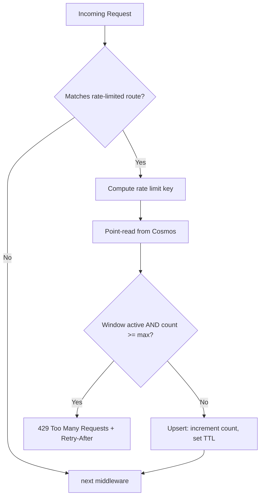

# Design: Cosmos DB-Backed Rate Limiting

## Summary

Add distributed rate limiting to Candour's three public API endpoints using a Cosmos DB container with TTL-based auto-cleanup. This approach persists rate limit state across Function App scale-to-zero events and multi-instance scale-out, at a cost of ~$0.01–0.05/month.

## Problem

Candour's public endpoints accept unauthenticated requests:

| Endpoint | Risk |
|----------|------|
| `POST /api/surveys/{id}/responses` | Token brute-force, spam submissions |
| `POST /api/surveys/{id}/validate-token` | Token enumeration |
| `GET /api/surveys/{id}` | Scraping, reconnaissance |

Without rate limiting, an attacker can flood these endpoints. Azure Functions Flex Consumption charges per execution — a sustained attack increases cost and degrades service.

## Rejected Alternatives

| Option | Why Rejected |
|--------|-------------|
| Azure API Management | $30–50/month minimum — exceeds <$1/month budget |
| Azure Front Door | $20–50/month minimum — same budget problem |
| In-process memory (`System.Threading.RateLimiting`) | Counters reset on scale-to-zero; not shared across instances |

In-process memory is acceptable as a Phase 0 quick-win but does not provide durable protection.

## Design

### Middleware Placement

Rate limiting runs **between** authentication and anonymity middleware:

```
AuthenticationMiddleware   ← validates admin JWT (if applicable)
    ↓
RateLimitingMiddleware     ← NEW: checks Cosmos, returns 429 if exceeded
    ↓
AnonymityMiddleware        ← strips IP headers from respondent routes
    ↓
Function handlers          ← MediatR dispatch
```

**Why this order:**
- After auth: admin requests are already identified; rate limiting applies different policies to admin vs public
- Before anonymity: the middleware can read `X-Forwarded-For` for IP-based limiting on `GET /surveys/{id}` before AnonymityMiddleware strips it

Registration in `Program.cs`:

```csharp
builder.UseMiddleware<AuthenticationMiddleware>();
builder.UseMiddleware<RateLimitingMiddleware>();  // NEW
builder.UseMiddleware<AnonymityMiddleware>();
```

### Rate Limit Keys

Each endpoint uses a different key strategy based on what's available:

| Endpoint | Key Source | Key Format | Rationale |
|----------|-----------|------------|-----------|
| `GET /surveys/{id}` | IP address | `ip:{ip}:get-survey` | No token in GET requests; IP is the only identifier |
| `POST /surveys/{id}/validate-token` | Token hash | `token:{sha256(token)}:validate` | Token is in the request body; avoids IP dependency |
| `POST /surveys/{id}/responses` | Token hash | `token:{sha256(token)}:submit` | Same — token is the natural key |

Admin endpoints (`GET /surveys`, `POST /surveys`, etc.) are already gated by Entra ID JWT. Rate limiting is optional for these — an authenticated admin is unlikely to self-attack.

### Cosmos DB Container

Add a `rateLimits` container alongside the existing three:

| Property | Value |
|----------|-------|
| Container name | `rateLimits` |
| Partition key | `/key` |
| Default TTL | Enabled (container-level) |
| No unique key policy | Counters are upserted, not inserted |

#### Document Schema

```json
{
  "id": "ip:203.0.113.42:get-survey",
  "key": "ip:203.0.113.42:get-survey",
  "count": 7,
  "windowStart": "2026-02-27T14:00:00Z",
  "ttl": 60
}
```

- `id` and `key` are identical (partition key = document key for point reads)
- `count` increments per request within the window
- `windowStart` marks the beginning of the current fixed window
- `ttl` in seconds — Cosmos DB auto-deletes expired documents

#### RU Cost Estimate

| Operation | RUs | Frequency |
|-----------|-----|-----------|
| Point read (check counter) | ~1 RU | Every public request |
| Upsert (increment counter) | ~6 RU | Every public request |
| **Total per request** | **~7 RU** | |

At 1,000 requests/day: ~7,000 RU/day = ~210,000 RU/month ≈ **$0.05/month**.

### Per-Endpoint Policies

```json
{
  "RateLimiting": {
    "Policies": {
      "get-survey": {
        "WindowSeconds": 60,
        "MaxRequests": 30
      },
      "validate-token": {
        "WindowSeconds": 60,
        "MaxRequests": 10
      },
      "submit-response": {
        "WindowSeconds": 60,
        "MaxRequests": 5
      }
    }
  }
}
```

Bound via `IOptions<RateLimitingOptions>` following the existing `CosmosDbOptions` pattern.

### Middleware Logic

```
1. Extract route → determine which policy applies (or skip if no match)
2. Compute rate limit key:
   - GET /surveys/{id}:         key = "ip:{X-Forwarded-For}:get-survey"
   - POST .../validate-token:   key = "token:{SHA256(body.token)}:validate"
   - POST .../responses:        key = "token:{SHA256(body.token)}:submit"
3. Point-read document from Cosmos by id = key, partition = key
4. If document exists AND windowStart + windowSeconds > now AND count >= maxRequests:
   → Return 429 Too Many Requests with Retry-After header
5. If document exists AND window has expired:
   → Upsert with count = 1, new windowStart, TTL = windowSeconds
6. If document exists AND window is active AND count < max:
   → Upsert with count + 1
7. If document does not exist:
   → Upsert with count = 1, windowStart = now, TTL = windowSeconds
8. Call next(context)
```

Steps 4–7 collapse into a single upsert with conditional logic. The TTL ensures stale windows are garbage-collected without a cleanup job.

### Flow Diagram



### Interface

```csharp
public interface IRateLimitRepository
{
    Task<RateLimitEntry?> GetAsync(string key, CancellationToken ct = default);
    Task UpsertAsync(RateLimitEntry entry, CancellationToken ct = default);
}
```

Follows the existing repository pattern. Registered as singleton (like all Cosmos repositories).

### Configuration

Add to `CosmosDbOptions`:

```csharp
public string RateLimitsContainer { get; set; } = "rateLimits";
```

Add to `CosmosDbInitializer.InitializeAsync()`:

```csharp
await database.CreateContainerIfNotExistsAsync(new ContainerProperties
{
    Id = options.RateLimitsContainer,
    PartitionKeyPath = "/key",
    DefaultTimeToLive = -1  // container-level TTL enabled, per-document TTL used
});
```

Add to Bicep (`resources.bicep`):

```bicep
resource rateLimitsContainer 'Microsoft.DocumentDB/databaseAccounts/sqlDatabases/containers@2024-05-15' = {
  parent: database
  name: 'rateLimits'
  properties: {
    resource: {
      id: 'rateLimits'
      partitionKey: {
        paths: ['/key']
        kind: 'Hash'
      }
      defaultTtl: -1
    }
  }
}
```

### 429 Response Format

```json
{
  "error": "Rate limit exceeded. Try again in 42 seconds."
}
```

Headers:
- `Retry-After: 42` (seconds until window resets)
- `X-RateLimit-Limit: 10` (max requests per window)
- `X-RateLimit-Remaining: 0`

### Anonymity Considerations

- **IP-based keys (`GET /surveys/{id}`):** The IP is read from `X-Forwarded-For` *before* AnonymityMiddleware strips it. The IP is used only as a transient rate limit key — it is stored in Cosmos as part of the key string but auto-deleted by TTL within 60 seconds. This is a deliberate tradeoff: short-lived IP storage for abuse prevention.
- **Token-based keys (`POST` endpoints):** SHA256 of the token is already stored in UsedTokens permanently. Using it as a rate limit key adds no new linkability.
- **No logging of rate limit keys:** The middleware logs throttle events to Application Insights with endpoint name and count, but NOT the key value itself.

### Observability

Log throttled requests as custom Application Insights events:

```
RateLimitThrottled { endpoint: "validate-token", windowSeconds: 60 }
```

Set up an Azure Monitor alert if throttle count exceeds a threshold (indicates sustained attack or misconfigured client).

## Files Changed

| File | Change |
|------|--------|
| `src/Candour.Core/Interfaces/IRateLimitRepository.cs` | New interface |
| `src/Candour.Core/Entities/RateLimitEntry.cs` | New entity |
| `src/Candour.Infrastructure.Cosmos/Data/CosmosRateLimitRepository.cs` | New Cosmos implementation |
| `src/Candour.Infrastructure.Cosmos/CosmosDbOptions.cs` | Add `RateLimitsContainer` |
| `src/Candour.Infrastructure.Cosmos/CosmosDbInitializer.cs` | Create `rateLimits` container |
| `src/Candour.Infrastructure.Cosmos/DependencyInjection.cs` | Register `IRateLimitRepository` |
| `src/Candour.Functions/Middleware/RateLimitingMiddleware.cs` | New middleware |
| `src/Candour.Functions/Program.cs` | Register middleware after auth, before anonymity |
| `infra/resources.bicep` | Add `rateLimits` container |
| `tests/Candour.Functions.Tests/RateLimitingMiddlewareTests.cs` | New test file |

## Testing

- Unit test: middleware returns 429 when mock repository returns count >= max
- Unit test: middleware passes through when count < max
- Unit test: middleware skips non-matching routes
- Unit test: correct key extraction for each endpoint type
- Integration test: Cosmos upsert correctly increments and respects TTL
