# Candour — User Journey Test Evidence

> End-to-end walkthrough of 9 core user journeys, with evidence captured via browser automation and API testing.

**Date:** 2026-02-27
**System:** Candour anonymity-first survey platform
**Infra:** Azure Functions (Flex Consumption), Azure Cosmos DB (Serverless), Azure Static Web Apps
**Frontend:** https://app.candour.example
**API:** https://api.candour.example

---

## Journey 0: Home Page & Navigation

**Goal:** Verify the landing page loads with branding, CTA, and navigation.

**Steps:**
1. Navigate to the frontend URL
2. Observe the page content and layout

**Expected:** Teal-themed app bar with "Candour" branding. Hero tagline ("Truth needs no name."), CTA button, how-it-works timeline, and three privacy feature cards with icons.

**Evidence:**
- 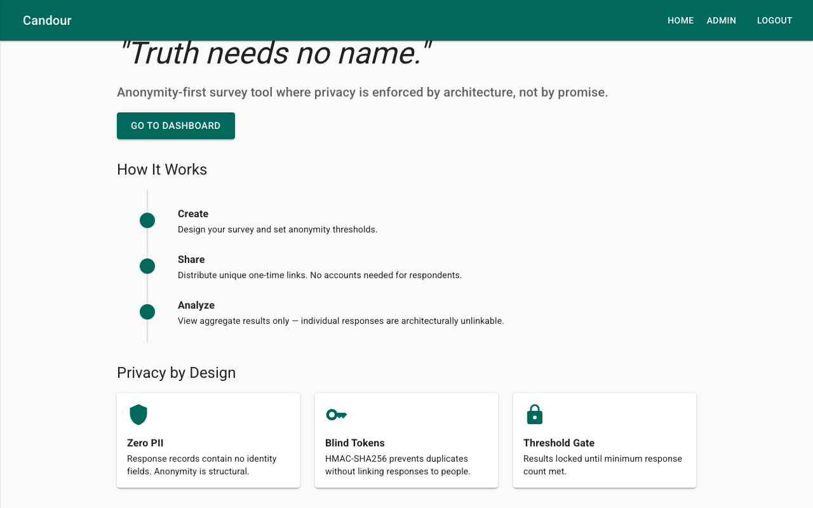
- 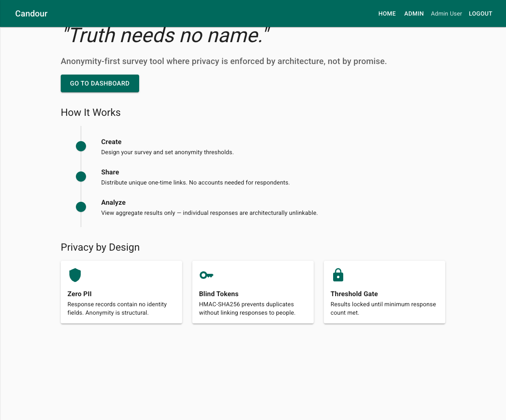

**Verified:**
- Teal app bar with Home / Admin / Logout navigation
- H3 tagline with proper contrast (no longer pink)
- Auth-aware CTA: "Get Started" (logged out) → "Go to Dashboard" (authenticated)
- User name displayed in nav bar when authenticated
- How It Works timeline: Create → Share → Analyze
- Privacy by Design cards with Shield, Key, and Lock icons

---

## Journey 1: Admin Creates a Survey

**Goal:** Verify the survey builder form creates a survey with multiple question types.

**Requires:** Entra ID login as an admin-allowlisted user.

**Steps:**
1. Navigate to `/admin` — the Survey Dashboard
2. Click "Create New Survey" (navigates to `/admin/builder`)
3. Observe breadcrumb navigation: Admin > Create Survey
4. Fill in Title: "Employee Satisfaction Q1 2026"
5. Fill in Description: "Quarterly anonymous employee satisfaction survey"
6. Set Anonymity Threshold: 5
7. Set Timestamp Jitter: 10 minutes
8. Add 3 questions:
   - Q1: Multiple Choice — "How satisfied are you with your team?" (Options: Very Satisfied, Satisfied, Neutral, Dissatisfied)
   - Q2: Free Text — "What would improve your work environment?"
   - Q3: Rating (Stars) — "Rate your overall job satisfaction"
9. Click "Create Survey"

**Expected:** Redirect to `/admin/survey/{id}` showing the created survey in Draft status with breadcrumbs (Admin > Survey Title).

**Evidence:**
- 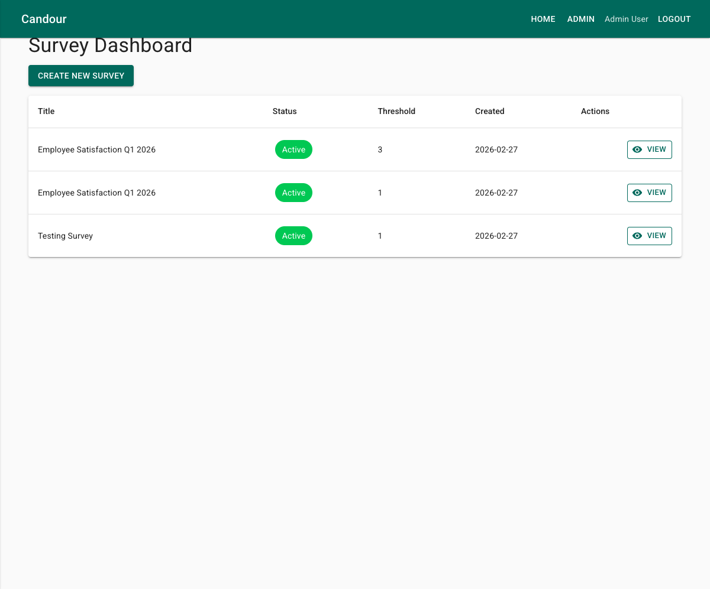
- 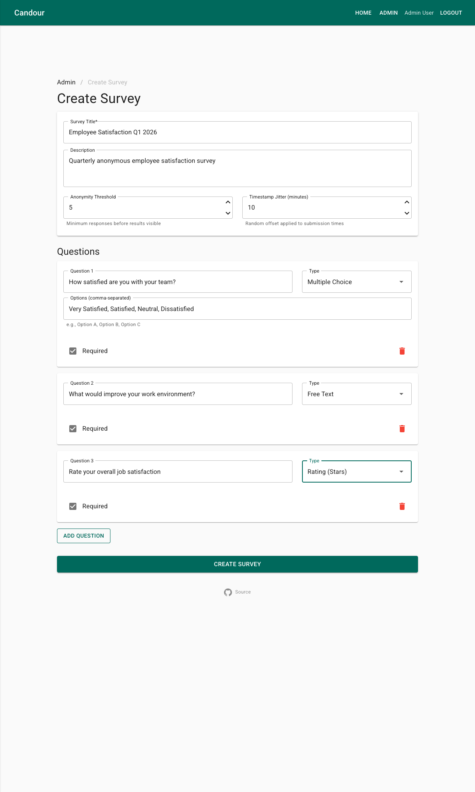
- 

**Verified:**
- Admin Dashboard shows survey table with Active status badge, threshold, created date
- "Create New Survey" button navigates to builder
- Breadcrumb navigation (Admin > Create Survey)
- Friendly question type labels ("Multiple Choice", "Free Text", "Rating (Stars)", "Matrix (Likert)", "Yes / No")
- Delete confirmation dialog when removing questions
- Anonymity Threshold and Timestamp Jitter helper text
- Created survey shows Draft status with green "Publish Survey" button

---

## Journey 2: Admin Publishes Survey & Gets Tokens

**Goal:** Verify publishing generates anonymity tokens with fully-qualified shareable links.

**Requires:** Entra ID login as an admin-allowlisted user.

**Steps:**
1. Navigate to `/admin/survey/{id}` (survey from Journey 1)
2. Confirm survey is in "Draft" status
3. Click "Publish Survey" (only visible in Draft status — conditionally rendered)
4. Expand "Show Tokens" panel
5. Use "Copy All Links" to copy all token URLs

**Expected:** Survey status changes to "Active". Token list shows FQDN links in format `https://app.candour.example/survey/{id}?t=TOKEN`. Each token has an individual copy button. "Copy All Links" copies all URLs to clipboard.

**Evidence:**
- 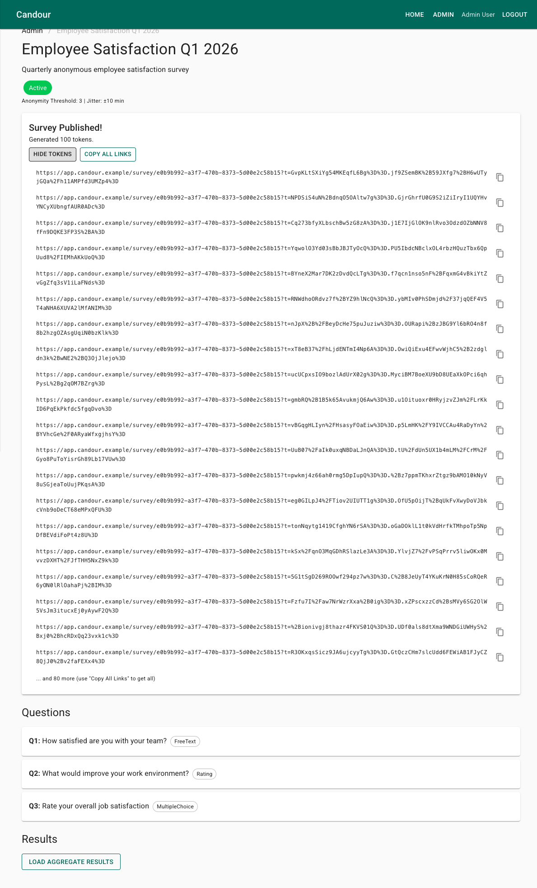

**Verified:**
- Publish button only rendered when status is Draft (no hidden DOM element)
- Status changes from "Draft" to "Active" after publish
- "Survey Published!" card shows "Generated 100 tokens"
- FQDN token links (not relative paths)
- Per-token copy-to-clipboard icon button
- Bulk "Copy All Links" button for distribution
- Question options displayed as chips under each question

---

## Journey 3: Respondent Submits Anonymous Response

**Goal:** Verify respondents can submit anonymous responses using unique tokens without authentication.

**Note:** Anonymous respondents use an unauthenticated API client via keyed DI services (previously crashed with `AccessTokenNotAvailableException`).

**Steps:**
1. Navigate to `/survey/{id}?t={token}`
2. Select an answer (e.g., "Satisfied" radio button)
3. Click "Submit Anonymously"

**Expected:** Success message: "Your anonymous response has been recorded" and "Your response cannot be linked back to you. The token has been consumed."

**Evidence:**
- 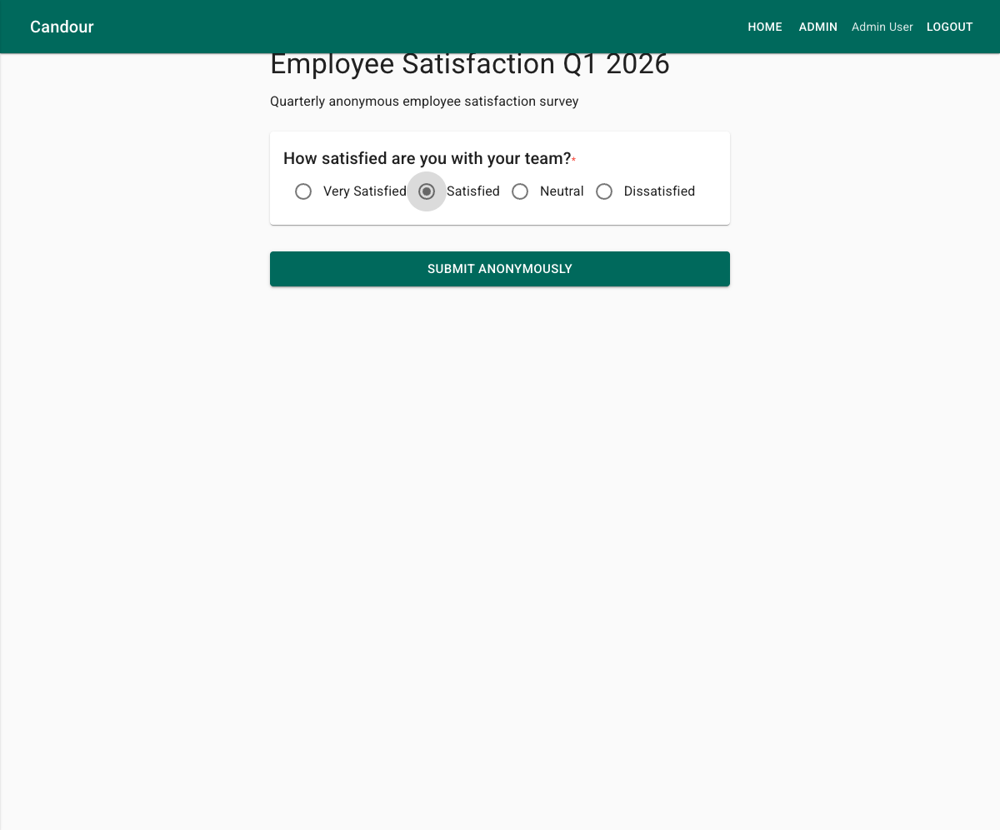
- 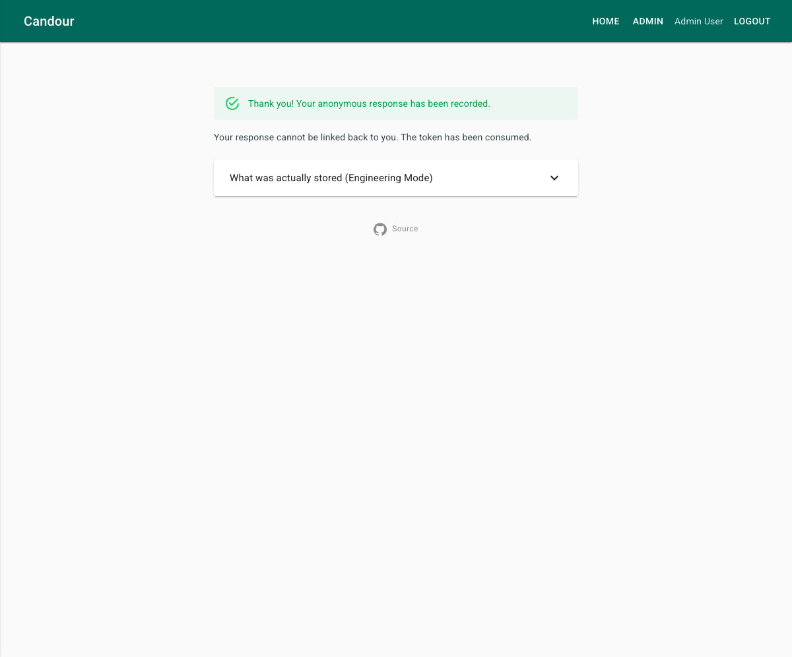
- 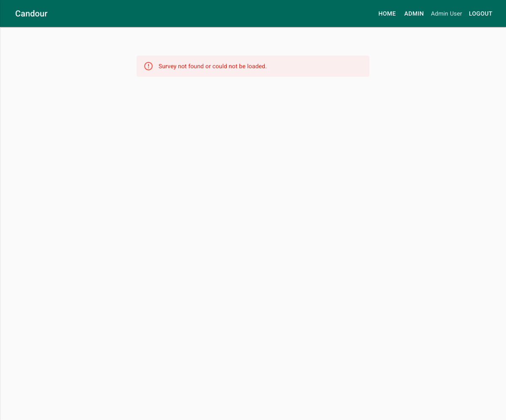

**Verified:**
- Survey loads without authentication (keyed DI fix working)
- Multiple choice renders as radio buttons with option labels
- Required fields marked with red asterisk
- "Submit Anonymously" button in teal
- Success alert confirms anonymous recording
- Privacy reassurance: "Your response cannot be linked back to you. The token has been consumed."
- Invalid survey URL shows graceful MudBlazor error alert (not crash)

---

## Journey 4: Admin Views Aggregate Results

**Goal:** Verify aggregate results display correctly after threshold is met and require admin authentication.

**Requires:** Entra ID login as an admin-allowlisted user.

**Steps:**
1. Navigate to `/admin/survey/{id}`
2. Click "Load Aggregate Results"

**Expected:** Results show (only accessible to authenticated admin users):
- Total Responses count
- Option counts with percentages in a table (Multiple Choice / Yes-No)
- Shuffled free text responses in a list (Free Text)
- Average rating displayed as "X / 5" (Rating)

**Evidence:**
- 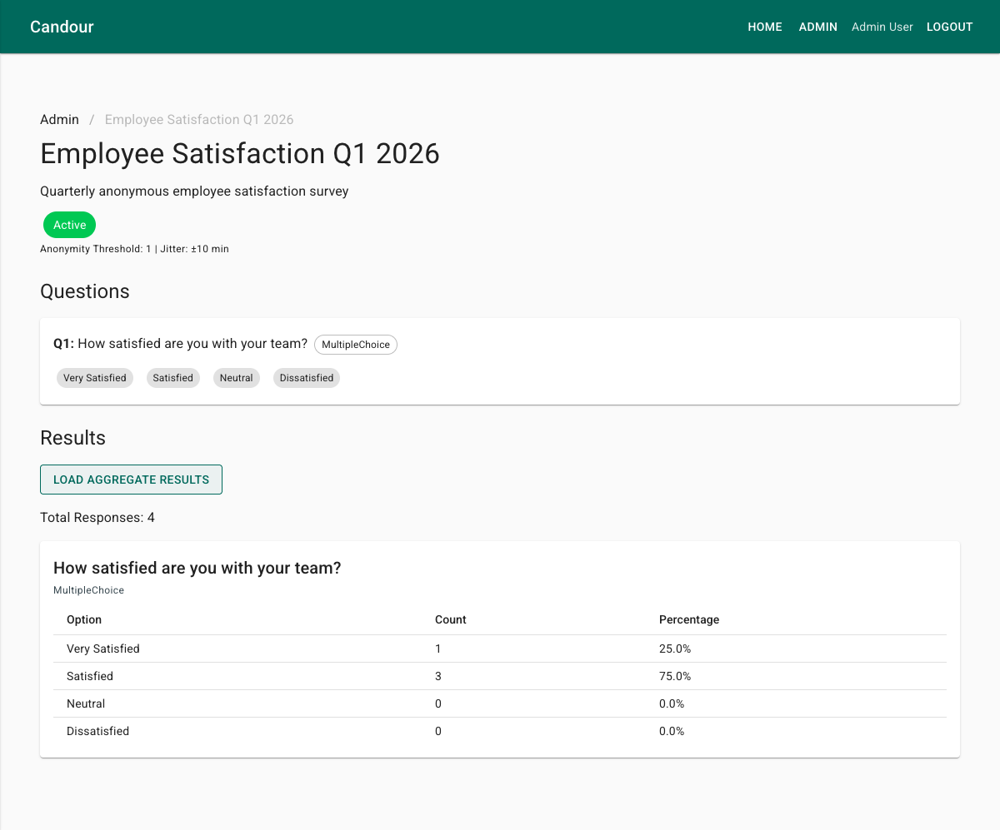

**Verified:**
- Breadcrumb navigation: Admin > Employee Satisfaction Q1 2026
- "Total Responses: 4" displayed
- Results table with Option / Count / Percentage columns
- Very Satisfied: 1 (25.0%), Satisfied: 3 (75.0%), Neutral: 0 (0.0%), Dissatisfied: 0 (0.0%)
- Results only accessible after admin authentication

---

## Journey 5: Threshold Gate — Results Blocked Below Minimum

**Goal:** Verify results are gated when response count is below the anonymity threshold.

**Steps:**
1. Navigate to admin view of a survey with 1 response (threshold=5)
2. Click "Load Aggregate Results"

**Expected:** Warning alert indicating insufficient responses.

**Evidence:**
- 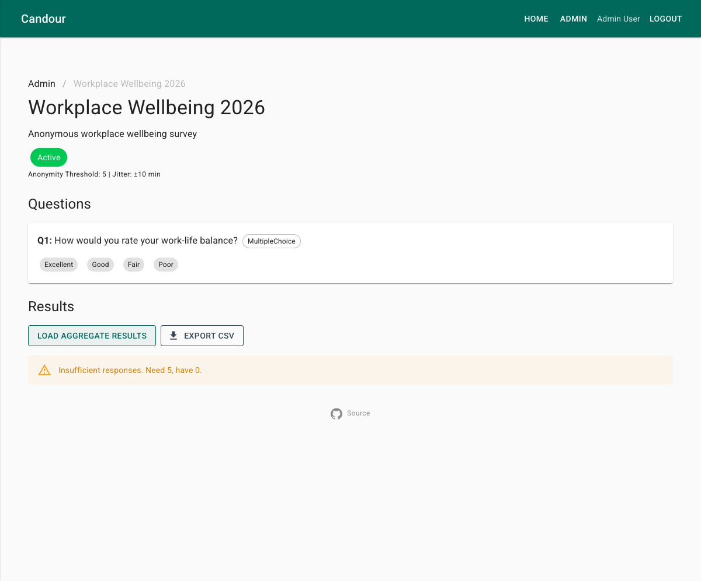

**Verified:**
- Warning alert displayed: "Insufficient responses. Need 5, have 1."
- No aggregate data exposed when below threshold
- Results section remains empty — only the warning is shown

---

## Journey 6: Token Reuse Prevention

**Goal:** Verify that an already-used token cannot be reused to submit another response.

**Steps:**
1. Navigate to `/survey/{id}?t={used-token}` (token already used in Journey 3)

**Expected:** Error message: token has already been consumed. The respondent is blocked from filling out the form.

**How it works:**
1. Server computes `SHA256(token)` and checks the UsedTokens table
2. If hash exists → 409 Conflict response
3. Original token is never stored — only the one-way hash

---

## Journey 7: API Auth Enforcement

**Goal:** Verify the API rejects unauthenticated requests to admin endpoints while allowing public endpoints.

**Evidence (captured 2026-02-27 from live deployment):**

```
=== Admin Endpoints (require Entra ID JWT) ===
Test 1: GET  /api/surveys                    → HTTP 401 Unauthorized
Test 2: POST /api/surveys                    → HTTP 401 Unauthorized
Test 3: GET  /api/surveys/{id}/results       → HTTP 401 Unauthorized

=== Public Endpoints (no auth required) ===
Test 4: GET  /api/surveys/{id}               → HTTP 404 (survey not found, but endpoint accessible)
Test 5: POST /api/surveys/{id}/validate-token → HTTP 200 {"valid":false,"error":"Survey not found"}
```

**Analysis:**
- Admin endpoints (`GET /surveys`, `POST /surveys`, `GET /results`) correctly return 401 when no JWT is provided
- Public endpoints (`GET /surveys/{id}`, `POST /validate-token`) are accessible without authentication
- The `POST /responses` endpoint is also public (blind token auth only)
- Token validation correctly reports that the survey doesn't exist (test used a fake UUID)

---

## Journey 8: 404 Page

**Goal:** Verify non-existent routes display a styled error page.

**Steps:**
1. Navigate to a non-existent URL (e.g., `/nonexistent-page`)

**Expected:** Styled 404 page with search icon, "Page Not Found" heading, explanation text, and "Go Home" button.

**Evidence:**
- 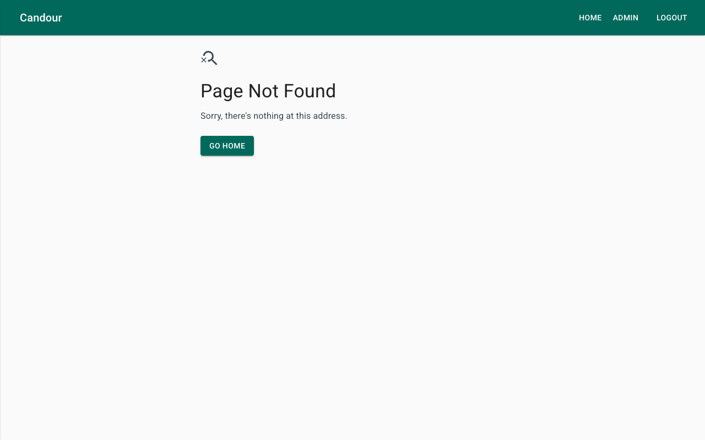

---

## Screenshot Inventory

| Screenshot | Journey | Description |
|-----------|---------|-------------|
| `home-page.png` | J0 | Landing page (logged out) |
| `home-page-authenticated.png` | J0 | Landing page with auth-aware CTA |
| `admin-dashboard.png` | J1 | Survey dashboard with table |
| `survey-builder.png` | J1 | Builder with 3 question types |
| `survey-detail-draft.png` | J1 | Created survey in Draft status |
| `survey-detail.png` | J1 | Survey detail with question chips |
| `survey-published-tokens.png` | J2 | Published with FQDN token links |
| `survey-form.png` | J3 | Respondent form with radio buttons |
| `survey-submitted.png` | J3 | Success confirmation |
| `survey-form-not-found.png` | J3 | Graceful error (C1 fix) |
| `aggregate-results.png` | J4 | Results table with percentages |
| `threshold-gate.png` | J5 | Insufficient responses warning |
| `404-page.png` | J8 | Styled 404 page |

