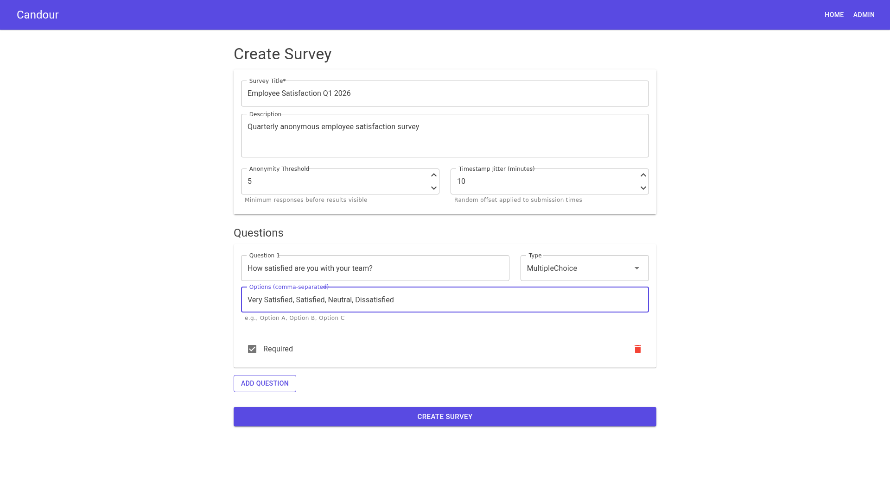
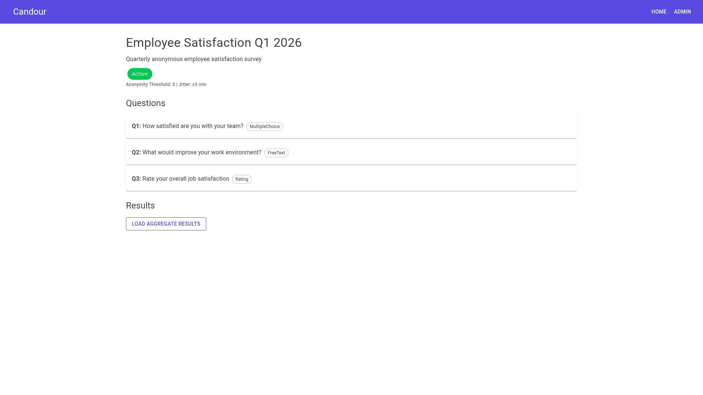
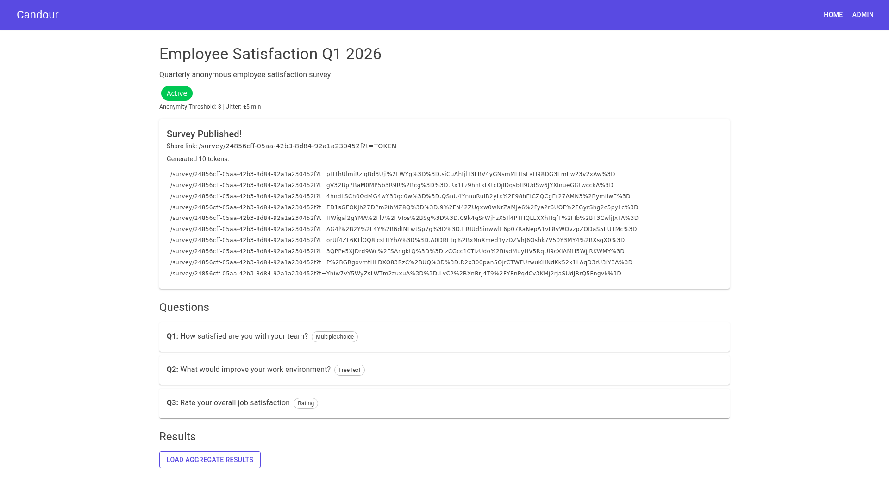
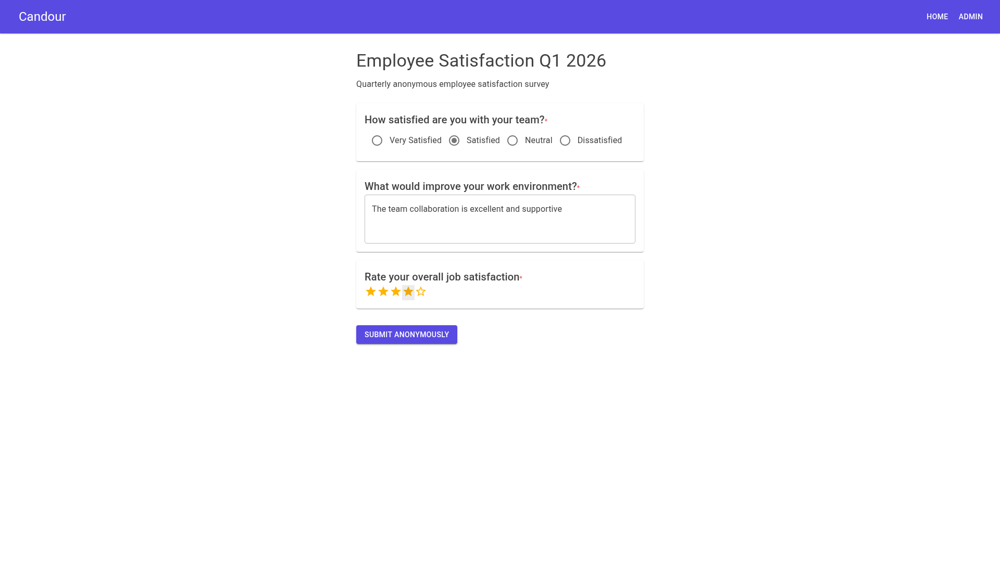
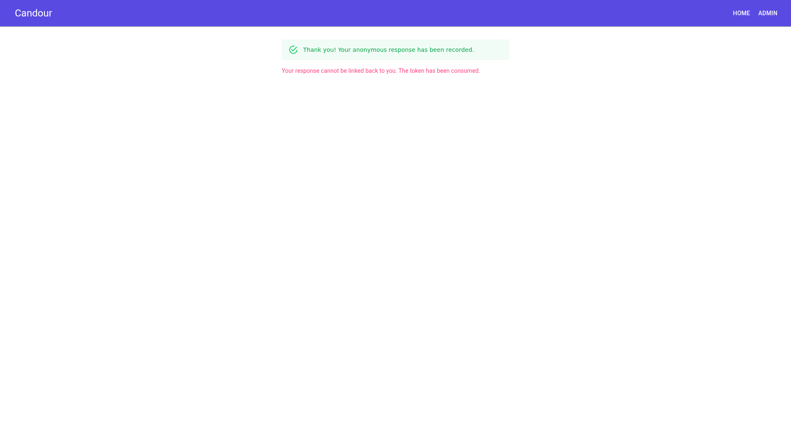
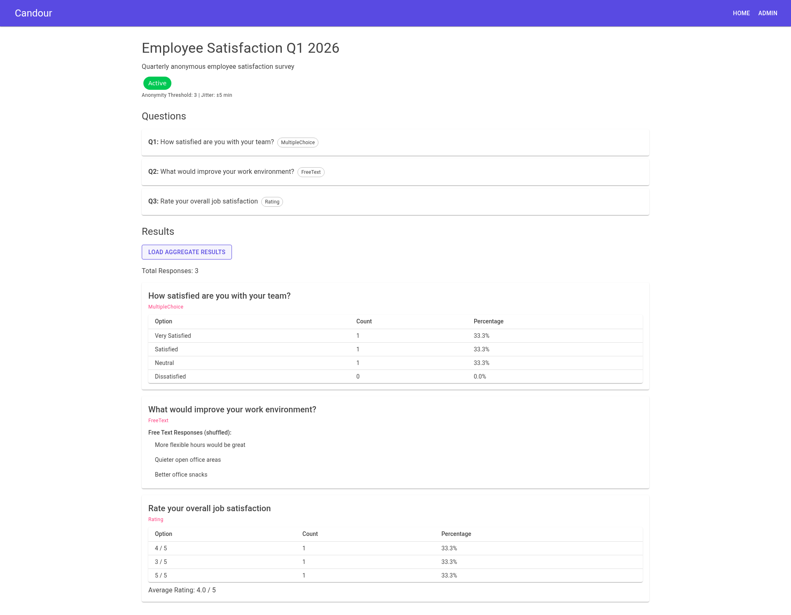
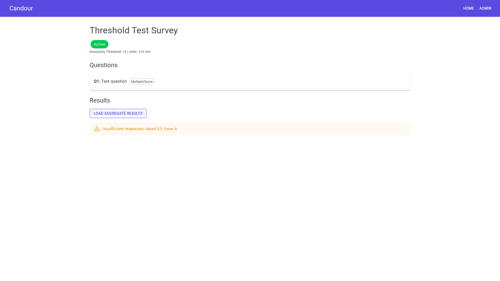
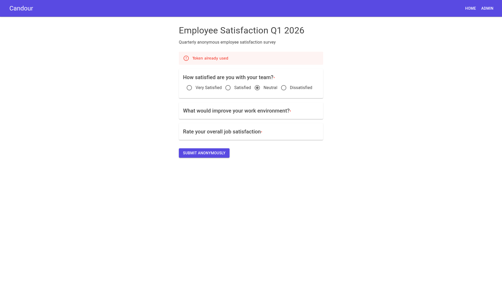

# Candour — User Journey Test Evidence

> End-to-end walkthrough of 7 core user journeys, with screenshot evidence captured via browser automation.

**Date:** 2026-02-26
**System:** Candour anonymity-first survey platform
**Infra:** Postgres 16 (Docker), Candour.Api (port 5219), Candour.Web (port 5125)

---

## Journey 1: Admin Creates a Survey

**Goal:** Verify the survey builder form creates a survey with multiple question types.

**Steps:**
1. Navigate to `http://localhost:5125/admin/builder`
2. Fill in Title: "Employee Satisfaction Q1 2026"
3. Fill in Description: "Quarterly anonymous employee satisfaction survey"
4. Set Anonymity Threshold: 3
5. Set Timestamp Jitter: 5 minutes
6. Add 3 questions:
   - Q1: MultipleChoice — "How satisfied are you with your team?" (Options: Very Satisfied, Satisfied, Neutral, Dissatisfied)
   - Q2: FreeText — "What would improve your work environment?"
   - Q3: Rating — "Rate your overall job satisfaction"
7. Click "Create Survey"

**Expected:** Redirect to `/admin/survey/{id}` showing the created survey in Draft status.

**Evidence:**
- 
- 

---

## Journey 2: Admin Publishes Survey & Gets Tokens

**Goal:** Verify publishing generates anonymity tokens with shareable links.

**Steps:**
1. Navigate to `/admin/survey/{id}` (survey from Journey 1)
2. Confirm survey is in "Draft" status
3. Click "Publish Survey"
4. Expand "Show Tokens" panel

**Expected:** Survey status changes to "Active". Token list displayed with `/survey/{id}?t=TOKEN` format links.

**Evidence:**
- 

---

## Journey 3: Respondent Submits Responses (x3 to meet threshold)

**Goal:** Verify three respondents can submit anonymous responses using unique tokens.

### Respondent 1
1. Navigate to `/survey/{id}?t={token1}`
2. Answer Q1: "Very Satisfied"
3. Answer Q2: "More flexible hours would be great"
4. Answer Q3: 4 stars
5. Click "Submit Anonymously"

### Respondent 2
1. Navigate to `/survey/{id}?t={token2}`
2. Answer Q1: "Satisfied"
3. Answer Q2: "Better office snacks"
4. Answer Q3: 3 stars
5. Click "Submit Anonymously"

### Respondent 3
1. Navigate to `/survey/{id}?t={token3}`
2. Answer Q1: "Neutral"
3. Answer Q2: "Quieter open office areas"
4. Answer Q3: 5 stars
5. Click "Submit Anonymously"

**Expected:** Each submission shows success: "Your anonymous response has been recorded" and "Your response cannot be linked back to you."

**Evidence:**
- 
- 

Note: Three responses were submitted (via browser and API) to meet the anonymity threshold of 3. The success screenshot shows the confirmation message: "Thank you! Your anonymous response has been recorded. Your response cannot be linked back to you. The token has been consumed."

---

## Journey 4: Admin Views Aggregate Results

**Goal:** Verify aggregate results display correctly after threshold is met.

**Steps:**
1. Navigate to `/admin/survey/{id}`
2. Click "Load Aggregate Results"

**Expected:** Results show:
- Total Responses: 3
- Q1 (MultipleChoice): Option counts and percentages
- Q2 (FreeText): Shuffled free text responses
- Q3 (Rating): Average rating

**Evidence:**
- 

---

## Journey 5: Threshold Gate — Results Blocked Below Minimum

**Goal:** Verify results are gated when response count is below the anonymity threshold.

**Steps:**
1. Create a new survey with Threshold=10
2. Publish the survey
3. Submit only 1 response
4. Navigate to admin view and click "Load Aggregate Results"

**Expected:** Error message indicating insufficient responses (below the anonymity threshold of 10).

**Evidence:**
- 

---

## Journey 6: Token Reuse Prevention

**Goal:** Verify that an already-used token cannot be reused to submit another response.

**Steps:**
1. Navigate to `/survey/{id}?t={token1}` (token already used in Journey 3)
2. Fill in answers
3. Click "Submit Anonymously"

**Expected:** Error message indicating the token has already been used.

**Evidence:**
- 

---

## Journey 7: API Auth Enforcement

**Goal:** Verify the API rejects requests without a valid API key.

**Steps:**
1. Configure API key in appsettings
2. Send `POST /api/surveys` without `X-Api-Key` header
3. Send `POST /api/surveys` with wrong `X-Api-Key` header

**Expected:** Both requests return `401 Unauthorized`.

**Evidence:**
- [API auth test results](screenshots/j7-api-auth.txt)

```
Test 1: No API key     → HTTP 401 Unauthorized
Test 2: Wrong API key  → HTTP 401 Unauthorized
Test 3: Correct key    → HTTP 200 OK
Test 4: POST no auth   → HTTP 401 Unauthorized
```
