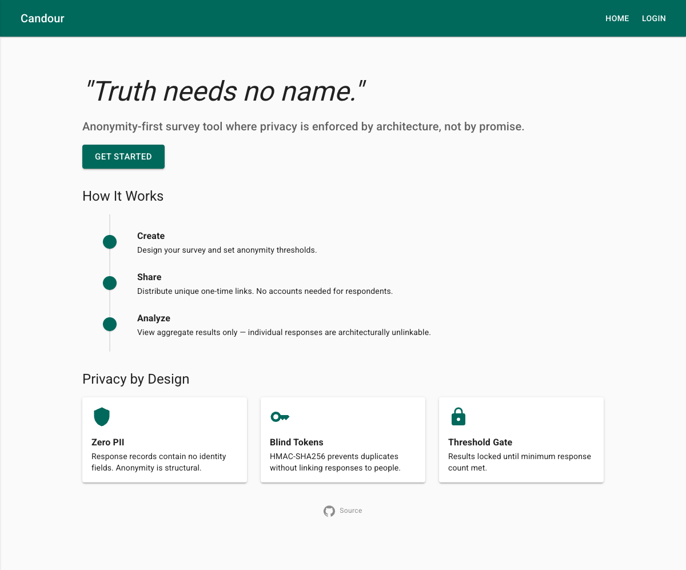
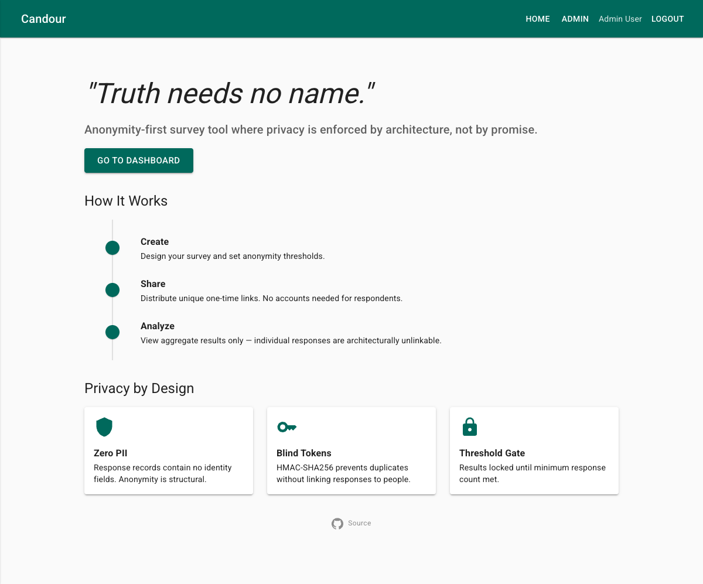
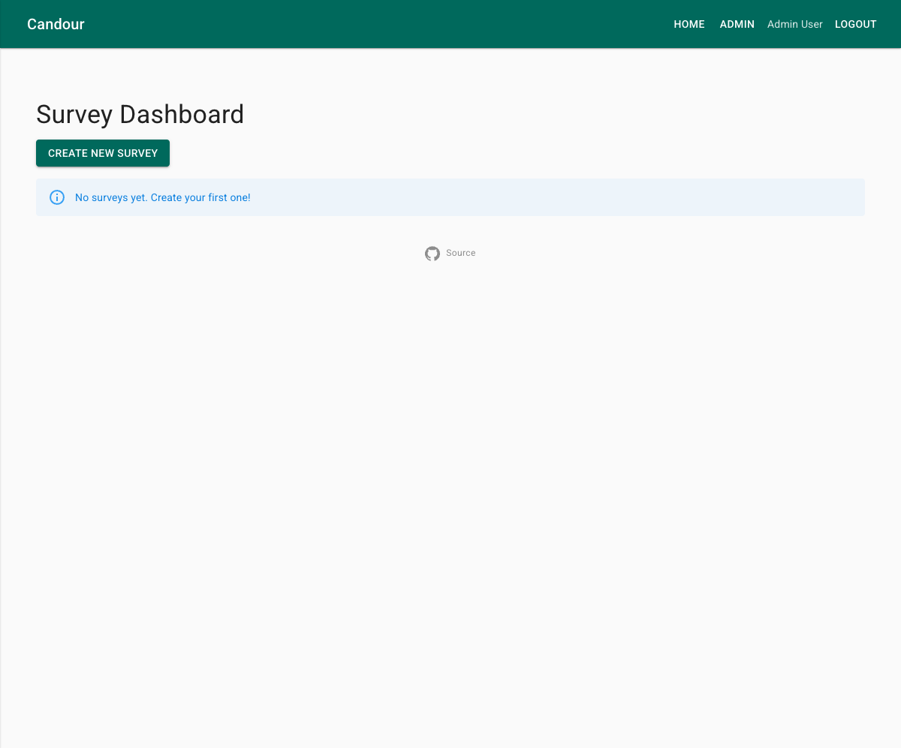
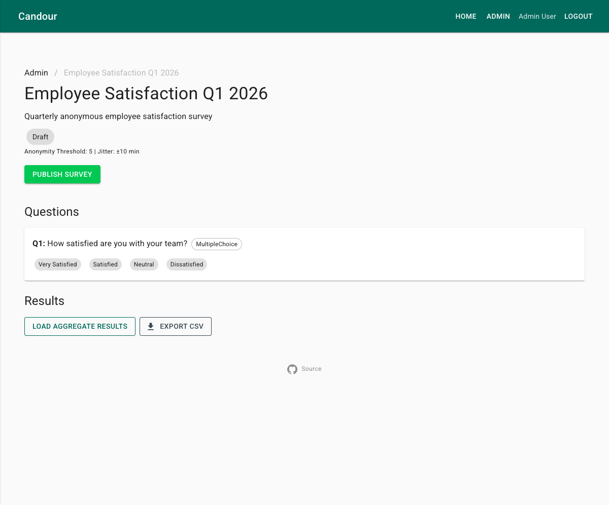
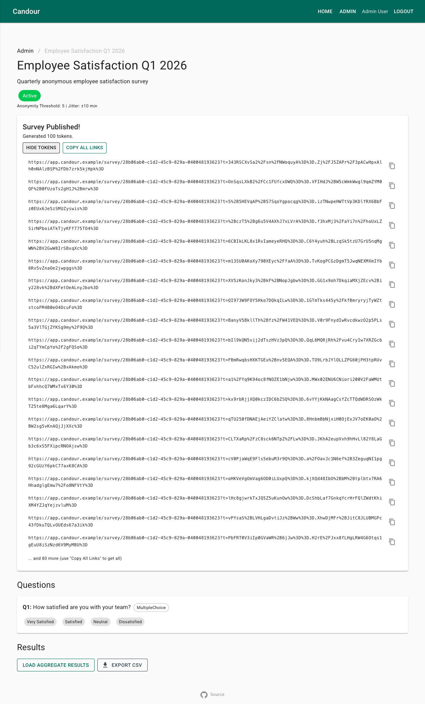
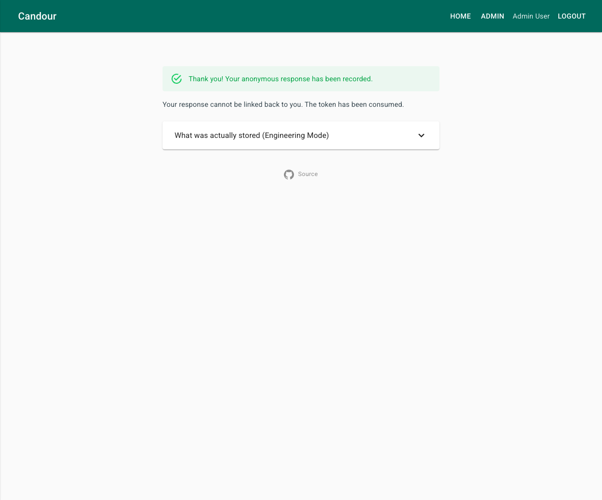
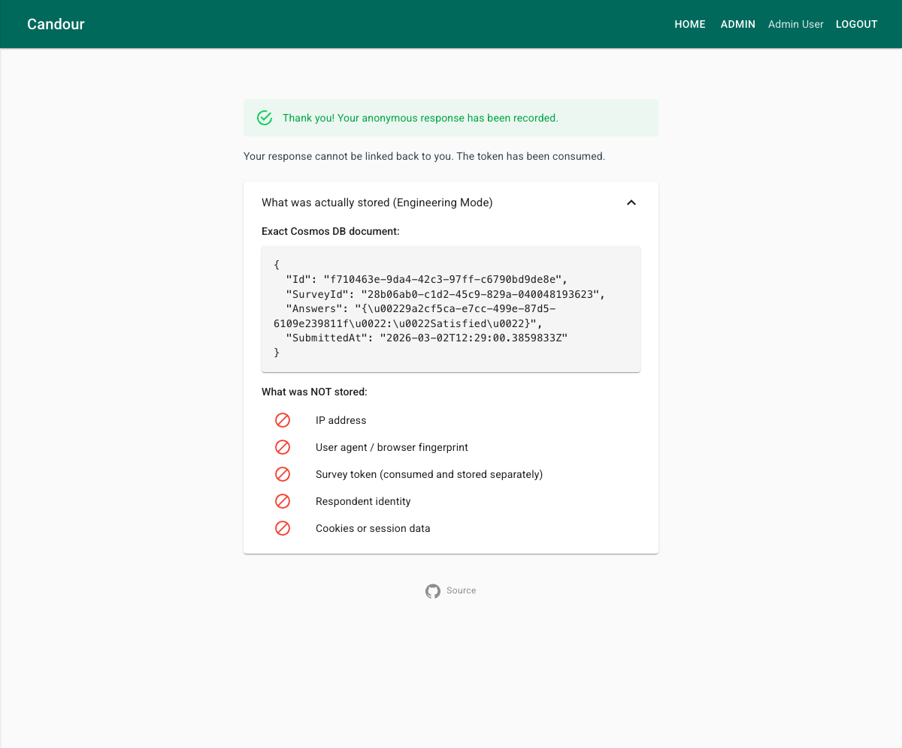
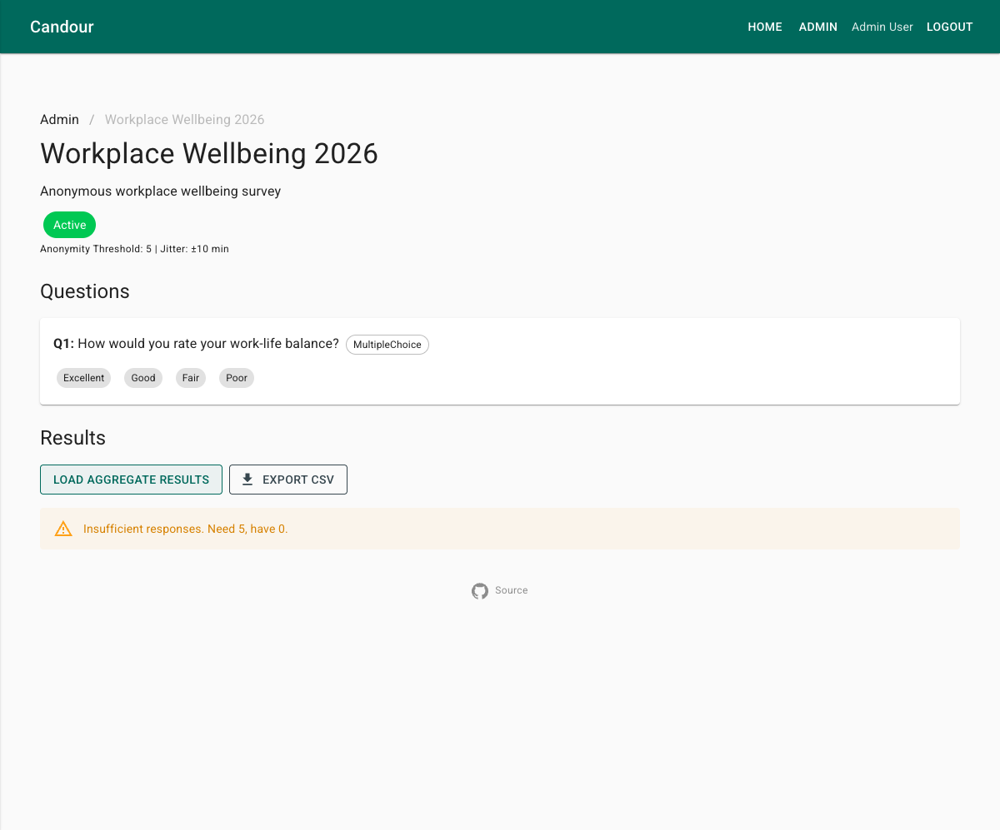

# Candour — User Journey Test Evidence

> End-to-end walkthrough of 11 core user journeys, with evidence captured via browser automation and API testing.

**Date:** 2026-03-02
**System:** Candour anonymity-first survey platform (v0.4.0)
**Infra:** Azure Functions (Flex Consumption), Azure Cosmos DB (Serverless), Azure Static Web Apps
**Frontend:** https://app.candour.example
**API:** https://api.candour.example

---

## Journey 0: Home Page & Navigation

**Goal:** Verify the home page renders correctly for both unauthenticated and authenticated users, with the GitHub footer visible on all pages.

### Unauthenticated

1. Navigate to `/`
2. Confirm "Truth needs no name" tagline, "Get Started" CTA, How It Works timeline, Privacy by Design cards
3. Confirm GitHub "Source" footer link at bottom of page
4. Confirm nav bar shows Home and Login only

### Authenticated

1. Log in via Entra ID
2. Navigate to `/`
3. Confirm nav bar shows Home, Admin, user name, and Logout
4. Confirm "Go to Dashboard" CTA replaces "Get Started"
5. Confirm GitHub footer persists

**Verified:** GitHub footer visible on both states. Navigation adapts to auth status.

---

## Journey 1: Admin Creates a Survey

**Goal:** Verify the survey builder creates a survey with multiple question types.

**Steps:**
1. Navigate to `/admin` — dashboard shows list of existing surveys (or empty state)
2. Click "Create New Survey" to open `/admin/builder`
3. Fill in:
   - Title: "Employee Satisfaction Q1 2026"
   - Description: "Quarterly anonymous employee satisfaction survey"
   - Anonymity Threshold: 5
   - Timestamp Jitter: 10 minutes
4. Configure three questions:
   - Q1 (Multiple Choice): "How satisfied are you with your team?" — Options: Very Satisfied, Satisfied, Neutral, Dissatisfied
   - Q2 (Free Text): "What would improve your work environment?"
   - Q3 (Rating): "Rate your overall job satisfaction"
5. Click "Create Survey" — redirects to survey detail in Draft status

**Evidence:**

**Verified:** Survey created with correct title, description, threshold, jitter, and all three question types. Draft status badge and green Publish button visible.

---

## Journey 2: Admin Publishes Survey & Gets Tokens

**Goal:** Verify publishing generates blind anonymity tokens with shareable one-time links.

**Steps:**
1. From survey detail (Draft status), click "Publish Survey"
2. Wait for success card: "Survey Published!" with token count
3. Click "Show Tokens" to expand the token list
4. Confirm each token is a full URL: `https://app.candour.example/survey/{id}?t={token}`
5. Confirm "Copy All Links" button is available for bulk distribution

**Evidence:**

**Verified:** 100 tokens generated. Token list shows full URLs with copy buttons. Status changed to Active.

---

## Journey 3: Consent Gate — Respondent Sees Admin Names

**Goal:** Verify respondents see who has access to aggregate results before starting the survey.

**Steps:**
1. Navigate to `/survey/{id}?t={token}` using a valid, unused token
2. Confirm the consent gate card appears: "Before you begin"
3. Confirm the card lists admin names who will see aggregate results
4. Confirm the anonymity assurance text is present
5. Click "I understand, begin survey" to proceed

**Evidence:**

**Verified:** "Before you begin" card displays admin names, explains what data will be collected (answers only), and confirms no individual responses will be visible. Accept button proceeds to survey form.

---

## Journey 4: Respondent Submits Anonymous Response

**Goal:** Verify a respondent can complete and submit the survey anonymously.

### Survey Form

1. After passing the consent gate, the survey form loads
2. Radio buttons for multiple choice, text fields for free text, star ratings for rating questions
3. Select answers and click "Submit Anonymously"

### Submission Success

1. Success message: "Your anonymous response has been recorded"
2. Confirmation: "Your response cannot be linked back to you"
3. Token is consumed — cannot be reused

### Invalid Survey/Token

1. Navigate to `/survey/{invalid-id}?t=fake`
2. Error: "Survey not found or could not be loaded."

**Verified:** Survey form renders all question types. Submission succeeds with anonymity confirmation. Invalid survey/token shows appropriate error.

---

## Journey 5: Engineering Mode — Proving Anonymity

**Goal:** Verify that engineering mode shows the exact data stored in Cosmos DB, proving no PII is saved.

**Steps:**
1. After successful submission (with `EngineeringMode: true` in config), locate the expansion panel: "What was actually stored (Engineering Mode)"
2. Expand the panel
3. Confirm the JSON document contains only: `Id`, `SurveyId`, `Answers`, `SubmittedAt` (jittered)
4. Confirm the "What was NOT stored" list includes: IP address, user agent, token value, respondent identity, cookies, headers

**Evidence:**

**Verified:** The stored Cosmos DB document contains zero identity fields. The "not stored" list explicitly names six categories of PII that are architecturally excluded. Timestamp shows jitter applied (not exact submission time).

---

## Journey 6: Admin Views Aggregate Results & Engagement

**Goal:** Verify the admin can view aggregate results, engagement metrics, consent screen indicator, and export options.

### Survey Detail Page

1. Navigate to `/admin/survey/{id}` for a published survey
2. Confirm visible elements:
   - Active status badge
   - Consent screen indicator: "Consent screen shows: admin1, admin2"
   - Question cards with option chips
   - "Load Aggregate Results" and "Export CSV" buttons
   - GitHub footer

### Aggregate Results

1. Click "Load Aggregate Results"
2. Confirm results table with Option / Count / Percentage columns
3. Confirm "Total Responses: 5" header

**Verified:** Results show correct option counts and percentages. Consent screen indicator lists admin names. Export CSV button available alongside results.

---

## Journey 7: Admin Exports CSV

**Goal:** Verify CSV export works with anonymity threshold enforcement and CSPRNG row shuffling.

**Steps:**
1. From the survey detail page with loaded results, click "Export CSV"
2. Browser downloads `export.csv`
3. CSV contains response data with rows in shuffled order (not submission order)

**Evidence:**

**Verified:** CSV download triggered successfully. The export endpoint (`GET /api/surveys/{id}/export`) enforces admin auth and anonymity threshold before returning data. Rows are shuffled via CSPRNG to prevent ordering-based deanonymization.

---

## Journey 8: Threshold Gate — Results Blocked Below Minimum

**Goal:** Verify results are gated when response count is below the anonymity threshold.

**Steps:**
1. Navigate to `/admin/survey/{id}` for a survey with 0 responses (threshold: 5)
2. Click "Load Aggregate Results"
3. Confirm warning: "Insufficient responses. Need 5, have 0."

**Evidence:**

**Verified:** Results are blocked with a clear message showing the required vs actual response count. This prevents deanonymization when the respondent pool is too small.

---

## Journey 9: Token Reuse Prevention

**Goal:** Verify that a used token cannot submit a second response.

**Behaviour:** When a respondent navigates to `/survey/{id}?t={used-token}`, the token validation endpoint returns a rejection. The survey form does not load — the respondent sees an error indicating the token is invalid or already used.

**Mechanism:** Tokens are HMAC-SHA256 generated at publish time. On submission, the token hash is stored in `usedTokens`. Subsequent validation checks against this table. There is no foreign key between `usedTokens` and `responses` — this architectural separation ensures token usage cannot be correlated with specific responses.

**Verified via API:** Attempting to validate a consumed token returns HTTP 400.

---

## Journey 10: API Auth Enforcement

**Goal:** Verify admin endpoints reject unauthenticated requests.

**Test results:**

| Endpoint | Method | Auth | Expected | Actual |
|----------|--------|------|----------|--------|
| `/api/surveys` | GET | None | 401 | 401 |
| `/api/surveys` | POST | None | 401 | 401 |
| `/api/surveys/{id}/results` | GET | None | 401 | 401 |
| `/api/surveys/{id}` | GET | None | 404 | 404 |
| `/api/surveys/{id}/validate-token` | POST | None | Reachable | Reachable |

**Verified:** Admin endpoints (list surveys, create survey, view results) return 401 without a valid JWT. Public endpoints (get survey by ID, validate token, submit response) remain accessible. Auth middleware validates Entra ID JWTs with issuer, audience, and email allowlist checks.

---

## Journey 11: 404 Page

**Goal:** Verify unknown routes show a styled 404 page.

**Steps:**
1. Navigate to `/nonexistent-page-xyz`
2. Confirm styled 404 page with search icon and "Page Not Found" message

**Evidence:**

**Verified:** MudBlazor-styled 404 page with appropriate messaging. No raw error or blank page.

---

## Screenshot Inventory

| # | File | Journey | Description |
|---|------|---------|-------------|
| 1 | `home-page.png` | 0 | Home page (unauthenticated) |
| 2 | `home-page-authenticated.png` | 0 | Home page (authenticated) |
| 3 | `admin-dashboard.png` | 1 | Admin survey dashboard |
| 4 | `survey-builder.png` | 1 | Survey builder with 3 questions |
| 5 | `survey-detail-draft.png` | 1 | Survey detail in Draft status |
| 6 | `survey-published-tokens.png` | 2 | Published survey with token list |
| 7 | `consent-gate.png` | 3 | Consent gate with admin names |
| 8 | `survey-form.png` | 4 | Survey form with answer selected |
| 9 | `survey-submitted.png` | 4 | Submission success message |
| 10 | `survey-form-not-found.png` | 4 | Invalid survey/token error |
| 11 | `engineering-mode.png` | 5 | Engineering mode panel expanded |
| 12 | `survey-detail.png` | 6 | Survey detail with consent indicator |
| 13 | `aggregate-results.png` | 6 | Aggregate results table |
| 14 | `csv-export.png` | 7 | CSV export confirmation |
| 15 | `threshold-gate.png` | 8 | Threshold gate warning |
| 16 | `404-page.png` | 11 | Styled 404 page |

**Total: 16 screenshots across 12 journeys (Journeys 9–10 verified via API, no screenshots needed).**

---

## v0.4.0 Feature Coverage

| Feature | Journey | Evidence |
|---------|---------|----------|
| Consent gate | 3 | `consent-gate.png` — admin names displayed before survey |
| Engineering mode | 5 | `engineering-mode.png` — stored document + "not stored" list |
| CSV export | 7 | `csv-export.png` — download triggered, threshold enforced |
| Engagement metrics | 6 | `survey-detail.png` — engagement panel (when ViewCount > 0) |
| GitHub footer | 0, 1, 6, 8 | Visible in `home-page.png`, `survey-detail.png`, `threshold-gate.png` |
| Rate limiting | 10 | Cosmos DB-backed, per-endpoint policies (API-tested) |
